# Design Document: System Design Simulation & Learning Platform (SaaS)

## Overview

The System Design Simulation & Learning Platform is a comprehensive SaaS-based interactive learning platform that enables users to visually design, simulate, and analyze real-world distributed systems under varying scale and constraints, from 1 user to 1 billion users. The platform acts as a "System Design Flight Simulator" that transforms abstract concepts into lived experience through the core learning loop: **Build → Scale → Break → Observe → Fix → Repeat**.

### Core Value Proposition

The platform addresses the critical gap in system design education by providing experiential learning through realistic simulation. Unlike static diagram tools, it teaches the "why" behind architectural decisions through:

- **Interactive Canvas**: Drag-and-drop interface for building system architectures using standard distributed system components
- **Scale Simulation**: Dynamic traffic simulation from 1 user to 1 billion users with real-time performance feedback
- **Failure Injection**: Realistic failure scenarios to test system resilience and recovery patterns
- **Cost Modeling**: Real-time cost implications to understand performance vs cost tradeoffs
- **Collaborative Learning**: Multi-user real-time editing and sharing capabilities

### SRS Compliance Architecture

The design directly implements the 10 functional requirements (FR-1 through FR-10) specified in the SRS:

1. **FR-1 User Authentication**: Secure account management with OAuth integration
2. **FR-2 Visual Canvas**: Drag-and-drop system design interface
3. **FR-3 Component Library**: Standard distributed system components with realistic behavior
4. **FR-4 Traffic Simulation**: Load simulation engine with queueing theory
5. **FR-5 Scale Control**: Dynamic scaling from 1 to 1 billion users
6. **FR-6 Failure Injection**: Realistic constraint and failure injection capabilities
7. **FR-7 Metrics Dashboard**: Comprehensive observability and performance metrics
8. **FR-8 Cost Modeling**: Real-time cost calculation and optimization
9. **FR-9 Learning Scenarios**: Guided learning experiences and predefined scenarios
10. **FR-10 Collaboration**: Real-time multi-user collaboration features

### Target User Classes (SRS Section 2.2)

The platform serves five distinct user classes with tailored experiences:

1. **Learners**: Students and job-seekers learning system design fundamentals through progressive curriculum
2. **Engineers**: Practicing engineers experimenting with architectures and testing design decisions
3. **Instructors**: Teachers creating guided scenarios and monitoring student progress
4. **Interview Candidates**: Users practicing system design interviews with timed challenges
5. **Administrators**: Platform operators managing the multi-tenant SaaS infrastructure

## Architecture

### High-Level SaaS Architecture (SRS Compliant)

The architecture follows a microservices pattern optimized for multi-tenant SaaS delivery, directly implementing the SRS non-functional requirements (NFR-1 through NFR-17):

```mermaid
graph TB
    subgraph "CDN & Edge Layer"
        CDN[Global CDN]
        Edge[Edge Servers]
        LB[Load Balancer]
    end
    
    subgraph "API Gateway & Security"
        Gateway[API Gateway]
        AuthSvc[Auth Service - FR-1]
        RateLimit[Rate Limiting - NFR-11]
        Security[Security Layer - NFR-9,10,11]
    end
    
    subgraph "Frontend Layer - FR-2"
        UI[Visual Canvas UI]
        Canvas[Drag-Drop Interface]
        Simulator[Scale Simulator - FR-5]
        Metrics[Metrics Dashboard - FR-7]
        Collab[Collaboration UI - FR-10]
    end
    
    subgraph "Core Microservices"
        UserSvc[User Service - FR-1]
        CanvasSvc[Canvas Service - FR-2]
        SimSvc[Simulation Service - FR-4,5]
        ComponentSvc[Component Service - FR-3]
        FailureSvc[Failure Injection - FR-6]
        CostSvc[Cost Modeling - FR-8]
        LearningSvc[Learning Service - FR-9]
        CollabSvc[Collaboration Service - FR-10]
    end
    
    subgraph "Simulation Engine - FR-4,5,6"
        TrafficEngine[Traffic Simulation]
        ScaleEngine[Scale Control Engine]
        FailureEngine[Failure Injection Engine]
        MetricsEngine[Metrics Collection]
    end
    
    subgraph "Data Layer"
        UserDB[(User Database)]
        CanvasDB[(Canvas/Workspace DB)]
        SimDB[(Simulation Results)]
        LearningDB[(Learning Progress)]
        Cache[(Redis Cache)]
        FileStore[File Storage]
        MessageQueue[Real-time Messages]
    end
    
    subgraph "Infrastructure - NFR-4,5,6,7,8"
        Monitor[Monitoring & Logging]
        AutoScale[Auto Scaling]
        Backup[Backup & Recovery]
        Security2[Security & Compliance]
    end
    
    CDN --> LB
    LB --> Gateway
    Gateway --> Security
    Security --> AuthSvc
    
    UI --> Gateway
    Canvas --> Gateway
    Simulator --> Gateway
    Metrics --> Gateway
    Collab --> Gateway
    
    Gateway --> UserSvc
    Gateway --> CanvasSvc
    Gateway --> SimSvc
    Gateway --> ComponentSvc
    Gateway --> FailureSvc
    Gateway --> CostSvc
    Gateway --> LearningSvc
    Gateway --> CollabSvc
    
    SimSvc --> TrafficEngine
    SimSvc --> ScaleEngine
    FailureSvc --> FailureEngine
    SimSvc --> MetricsEngine
    
    UserSvc --> UserDB
    CanvasSvc --> CanvasDB
    SimSvc --> SimDB
    LearningSvc --> LearningDB
    CollabSvc --> Cache
    CollabSvc --> MessageQueue
    
    Monitor --> UserSvc
    Monitor --> SimSvc
    AutoScale --> SimSvc
    Backup --> UserDB
    Backup --> CanvasDB
```



### SRS Non-Functional Requirements Implementation

The architecture directly addresses each SRS non-functional requirement:

**Performance (NFR-1, NFR-2, NFR-3)**:
- **Sub-100ms Updates**: Optimized simulation engine with efficient WebSocket communication
- **Real-time UI**: React-based frontend with optimistic updates and immediate feedback
- **User Isolation**: Multi-tenant architecture with isolated execution contexts and resource quotas

**Scalability (NFR-4, NFR-5)**:
- **Thousands of Users**: Horizontal scaling of microservices with auto-scaling capabilities
- **Simulation Scaling**: Dedicated compute clusters for simulation workloads with intelligent queuing

**Reliability (NFR-6, NFR-7, NFR-8)**:
- **User Isolation**: Strict tenant boundaries with encrypted data separation
- **Partial Failure Recovery**: Circuit breakers and graceful degradation across all services
- **Data Persistence**: Multi-region replication with automated backup and recovery

**Security (NFR-9, NFR-10, NFR-11)**:
- **Access Control**: Role-based access control (RBAC) with tenant-scoped permissions
- **Private by Default**: All user data private unless explicitly shared
- **Secure Authentication**: Multi-provider OAuth with JWT tokens and session management

**Usability (NFR-12, NFR-13, NFR-14)**:
- **Intuitive UI**: Progressive disclosure with contextual help and guided onboarding
- **Clear Feedback**: Detailed error messages with suggested remediation actions
- **Input Support**: Full accessibility compliance with keyboard navigation

**Maintainability (NFR-15, NFR-16, NFR-17)**:
- **Modular Design**: Microservices architecture with clear API boundaries
- **Extensible Components**: Plugin architecture for new component types
- **Deterministic Logic**: Reproducible simulation results for testing and validation

## Components and Interfaces

### Frontend Components (SRS FR-2 Implementation)

#### Visual System Design Canvas
- **Purpose**: Implements SRS FR-2 (Visual System Design Canvas) with drag-and-drop interface
- **Technology**: React with React DnD and custom canvas rendering optimized for performance
- **Key Features**:
  - **Drag-and-Drop Interface**: Users can drag components onto canvas and connect them with edges
  - **Component Positioning**: Components placed at drop location and made selectable
  - **Connection Validation**: System prevents invalid connections and provides clear feedback
  - **Component Grouping**: Visual grouping and labeling for complex architectures
  - **Parameter Configuration**: Component-specific configuration panels with validation

#### Component Library Interface (SRS FR-3)
- **Purpose**: Implements SRS FR-3 (Component Library) with standard distributed system components
- **Technology**: React component library with standardized component models
- **Key Features**:
  - **Standard Components**: Load Balancer, Database, Cache, Queue, CDN, Service per SRS FR-3.1
  - **Capacity Limits**: Each component exposes realistic capacity limits per SRS FR-3.2
  - **Scaling Strategies**: Components expose vertical/horizontal scaling options per SRS FR-3.3
  - **Consistency Options**: Database and cache components provide consistency/replication settings per SRS FR-3.4
  - **Configurable Parameters**: Component-specific parameters exposed through UI

#### Traffic & Load Simulation Interface (SRS FR-4, FR-5)
- **Purpose**: Implements SRS FR-4 (Traffic Simulation) and FR-5 (Scale Control)
- **Technology**: React with D3.js for real-time visualizations and WebSocket for sub-100ms updates
- **Key Features**:
  - **User Count/QPS Control**: Users can set traffic parameters per SRS FR-4.1
  - **Dynamic Scale Control**: Real-time scaling from 1 user to 1 billion users per SRS FR-5.1
  - **Real-Time Metrics**: System metrics update in real-time per SRS FR-5.2
  - **Bottleneck Visualization**: Visual highlighting of bottlenecks per SRS FR-5.3
  - **System Collapse Detection**: Detection and display of system failures per SRS FR-5.4

#### Failure Injection Interface (SRS FR-6)
- **Purpose**: Implements SRS FR-6 (Failure & Constraint Injection)
- **Technology**: React with real-time control panels and failure configuration
- **Key Features**:
  - **Component Disabling**: Users can disable components per SRS FR-6.1
  - **Latency Injection**: Configurable network latency injection per SRS FR-6.2
  - **Network Partitions**: Simulation of network partition scenarios per SRS FR-6.3
  - **Regional Outages**: Multi-component regional failure simulation per SRS FR-6.4
  - **Recovery Observation**: Visual feedback on recovery behavior per SRS FR-6.5

#### Metrics & Observability Dashboard (SRS FR-7)
- **Purpose**: Implements SRS FR-7 (Metrics & Observability Dashboard)
- **Technology**: React with Canvas API for high-performance rendering and real-time charts
- **Key Features**:
  - **Latency Metrics**: Display of p50, p95, p99 latency percentiles per SRS FR-7.1
  - **Error Rates**: Real-time error rate monitoring per SRS FR-7.2
  - **Throughput Metrics**: System throughput visualization per SRS FR-7.3
  - **Resource Saturation**: Component resource utilization display per SRS FR-7.4
  - **Node-Specific & Global Views**: Both component-level and system-wide metrics per SRS FR-7.5

#### Cost Modeling Dashboard (SRS FR-8)
- **Purpose**: Implements SRS FR-8 (Cost Modeling Engine)
- **Technology**: React with real-time charts integrated with cloud pricing APIs
- **Key Features**:
  - **Compute Cost Estimation**: Real-time compute cost calculation per SRS FR-8.1
  - **Storage Cost Tracking**: Storage cost estimation per SRS FR-8.2
  - **Network Cost Analysis**: Network transfer cost modeling per SRS FR-8.3
  - **Scale-Based Costing**: Cost scaling with traffic per SRS FR-8.4
  - **Performance Tradeoffs**: Cost vs performance analysis per SRS FR-8.5

### Backend Microservices (SRS Implementation)

#### User Authentication Service (SRS FR-1)
- **Purpose**: Implements SRS FR-1 (User Authentication & Account Management)
- **Technology**: Node.js with Express, JWT, and multi-provider OAuth integration
- **Key Responsibilities**:
  - **Account Creation**: Email and OAuth-based registration per SRS FR-1.1
  - **Authentication**: Login/logout functionality per SRS FR-1.2
  - **Design Management**: Save, load, delete user designs per SRS FR-1.3
  - **Tier Management**: Free and paid tier support per SRS FR-1.4
  - **Session Management**: Secure session handling and token management

#### Canvas Service (SRS FR-2)
- **Purpose**: Implements SRS FR-2 (Visual System Design Canvas) backend functionality
- **Technology**: Node.js with Express and real-time synchronization
- **Key Responsibilities**:
  - **Canvas State Management**: Persist and retrieve canvas configurations
  - **Component Placement**: Handle drag-and-drop component positioning
  - **Connection Management**: Manage component connections and validation
  - **Grouping & Labeling**: Support for component organization features
  - **Real-time Sync**: Synchronize canvas changes across collaborative sessions

#### Component Service (SRS FR-3)
- **Purpose**: Implements SRS FR-3 (Component Library) with standard component models
- **Technology**: Node.js with pluggable component architecture
- **Key Responsibilities**:
  - **Component Catalog**: Manage standard component library (LB, DB, Cache, Queue, CDN, Service)
  - **Parameter Management**: Handle component-specific configuration parameters
  - **Capacity Modeling**: Enforce realistic capacity limits for each component type
  - **Scaling Configuration**: Manage vertical/horizontal scaling strategies
  - **Consistency Settings**: Handle replication and consistency options for applicable components

#### Simulation Service (SRS FR-4, FR-5)
- **Purpose**: Implements SRS FR-4 (Traffic Simulation) and FR-5 (Scale Control)
- **Technology**: Node.js with worker processes for compute-intensive simulation
- **Key Responsibilities**:
  - **Traffic Generation**: Generate load based on user count or QPS settings
  - **Load Propagation**: Propagate traffic through system graph
  - **Queueing Simulation**: Model queueing and backpressure behavior
  - **Retry/Timeout Handling**: Simulate retry mechanisms and timeout behaviors
  - **Scale Management**: Handle dynamic scaling from 1 to 1 billion users
  - **Real-time Updates**: Provide sub-100ms metric updates
  - **Bottleneck Detection**: Identify and report system bottlenecks

#### Failure Injection Service (SRS FR-6)
- **Purpose**: Implements SRS FR-6 (Failure & Constraint Injection)
- **Technology**: Node.js with event-driven failure injection
- **Key Responsibilities**:
  - **Component Failures**: Simulate component outages and failures
  - **Latency Injection**: Introduce configurable network latency
  - **Partition Simulation**: Model network partition scenarios
  - **Regional Outages**: Coordinate multi-component regional failures
  - **Recovery Monitoring**: Track and report system recovery behavior

#### Learning Service (SRS FR-9)
- **Purpose**: Implements SRS FR-9 (Learning & Scenario Mode)
- **Technology**: Node.js with scenario management and progress tracking
- **Key Responsibilities**:
  - **Scenario Management**: Provide and manage predefined learning scenarios
  - **Progressive Constraints**: Introduce constraints progressively during scenarios
  - **Hint System**: Provide contextual hints and explanations
  - **Progress Tracking**: Track scenario completion and learning progress
  - **Difficulty Management**: Manage multiple difficulty levels and learning paths

#### Collaboration Service (SRS FR-10)
- **Purpose**: Implements SRS FR-10 (Collaboration) with real-time multi-user features
- **Technology**: Node.js with Socket.IO and operational transformation
- **Key Responsibilities**:
  - **Design Sharing**: Enable sharing of designs between users
  - **Multi-user Editing**: Support simultaneous editing by multiple users
  - **Real-time Sync**: Synchronize changes in real-time across all participants
  - **Version History**: Maintain complete version history for collaborative designs
  - **Access Control**: Manage permissions and access controls for shared designser, number]; // Mbps
        retryPolicies: RetryPolicy[];
      }
    }
  };
}

// Example: Load Balancer can connect to Services with specific parameters
const compatibility: ComponentCompatibility = {
  validConnections: {
    'LoadBalancer': {
      'Service': {
        connectionTypes: ['HTTP', 'HTTPS', 'TCP'],
        latencyRange: [1, 50], // 1-50ms typical for internal network
        bandwidthRange: [100, 10000], // 100Mbps to 10Gbps
        retryPolicies: ['exponential-backoff', 'circuit-breaker', 'none']
      }
    }
  }
};
```

### User Class-Specific Features

The platform provides tailored experiences for each of the five user classes identified in the SRS:

#### Learner Experience
- **Progressive Curriculum**: Structured learning path from single-server to distributed systems
- **Guided Scenarios**: Step-by-step tutorials for Twitter Feed, WhatsApp Messaging, Netflix Streaming, UPI Payments
- **Achievement System**: Skill-based achievements focusing on causality understanding and engineering intuition
- **Adaptive Difficulty**: Content difficulty adjusts based on performance and learning velocity
- **Peer Learning**: Community features for collaborative learning and knowledge sharing

#### Engineer Experience  
- **Advanced Simulation**: Full access to all Core Backend Engines with realistic failure injection
- **Cost Optimization**: Detailed cost modeling with optimization recommendations and tradeoff analysis
- **Collaboration Tools**: Team workspaces for architecture discussions and design reviews
- **Custom Scenarios**: Ability to create and share custom simulation scenarios
- **Performance Analysis**: Deep dive analytics into system performance and bottleneck identification

#### Instructor Experience
- **Instructor Mode**: Real-time control over student sessions with attention guidance
- **Curriculum Management**: Tools for creating custom learning paths and scenarios
- **Student Analytics**: Comprehensive dashboards showing student progress and engagement
- **Live Teaching**: Integrated voice/video for remote instruction with screen sharing
- **Assessment Tools**: Skill evaluation and progress tracking across multiple students

#### Interview Candidate Experience
- **Interview Mode**: Timed challenges with hidden constraints and performance pressure
- **Industry Scenarios**: Realistic system design problems from major tech companies
- **Performance Evaluation**: Scoring system aligned with industry interview criteria
- **Practice Sessions**: Unlimited practice with immediate feedback and improvement suggestions
- **Mock Interviews**: Simulated interview environment with realistic time constraints

#### Administrator Experience
- **Multi-Tenant Management**: Organization and user management with resource allocation
- **Platform Analytics**: Usage patterns, learning effectiveness, and system performance metrics
- **Resource Monitoring**: Real-time monitoring of simulation workloads and system health
- **Billing Integration**: Subscription management and usage-based billing
- **Security Management**: Access controls, audit logging, and compliance reporting

#### Multi-Scale Simulation Engine
- **Purpose**: Model system behavior across different user scales
- **Architecture**: Hierarchical simulation with scale-specific optimizations
- **Key Features**:
  - Adaptive simulation granularity based on scale
  - Realistic bottleneck modeling (database connections, network bandwidth)
  - Cost calculation integration with cloud pricing models
  - Failure scenario generation at scale

#### Component Models with Scale Awareness
Each system component includes scale-specific behavior modeling:

```typescript
interface ScalableComponentModel extends ComponentModel {
  scaleCharacteristics: ScaleCharacteristics;
  calculatePerformanceAtScale(userCount: number): PerformanceMetrics;
  identifyBottlenecksAtScale(userCount: number): Bottleneck[];
  suggestScalingStrategies(targetScale: number): ScalingStrategy[];
}

interface ScaleCharacteristics {
  maxConcurrentUsers: number;
  scalingType: 'vertical' | 'horizontal' | 'both';
  costModel: CostModel;
  bottleneckThresholds: BottleneckThreshold[];
}
```

#### Learning Analytics Engine
- **Purpose**: Track learning progress and provide personalized recommendations
- **Technology**: Machine learning models for pattern recognition
- **Key Features**:
  - Skill progression tracking across scalability concepts
  - Common mistake identification and remediation
  - Personalized learning path optimization
  - Peer comparison and collaborative learning insights

### API Interfaces

#### Authentication & User Management APIs
```typescript
// User Authentication implementing SRS FR-1
POST /api/auth/register - User registration with email verification and user class identification
POST /api/auth/login - Multi-provider login (email, Google, GitHub) with session establishment
POST /api/auth/logout - Secure logout with session cleanup and token invalidation
POST /api/auth/refresh - JWT token refresh with security validation
POST /api/auth/reset-password - Password reset flow with secure token generation
POST /api/auth/verify-email - Email verification with account activation

// User Profile Management
GET /api/users/profile - Get comprehensive user profile including learning preferences and progress
PUT /api/users/profile - Update user profile with validation and tenant-scoped changes
GET /api/users/progress - Get detailed learning progress, achievements, and skill assessments
PUT /api/users/preferences - Update learning preferences (pace, difficulty, notifications, theme)
DELETE /api/users/account - Account deletion with complete data cleanup and retention compliance
GET /api/users/subscription - Get subscription status and billing information
PUT /api/users/subscription - Update subscription tier and billing preferences
```

#### Multi-Tenant Workspace APIs
```typescript
// Workspace Management implementing SRS FR-2 with tenant isolation
POST /api/workspaces - Create new workspace with tenant-scoped access and resource quota validation
GET /api/workspaces - List user's workspaces with tenant filtering and permission-based access
GET /api/workspaces/:id - Load workspace with comprehensive tenant validation and access control
PUT /api/workspaces/:id - Save workspace with tenant-scoped changes and version control
DELETE /api/workspaces/:id - Delete workspace with tenant-scoped cleanup and audit logging
GET /api/workspaces/:id/history - Get complete version history with rollback capabilities
POST /api/workspaces/:id/rollback - Rollback to specific version with conflict resolution

// Collaboration APIs implementing SRS FR-10
POST /api/workspaces/:id/share - Share workspace with granular permissions (viewer/editor/admin)
PUT /api/workspaces/:id/collaborate - Enable real-time collaboration with operational transformation
GET /api/workspaces/:id/collaborators - List workspace collaborators with presence information
DELETE /api/workspaces/:id/share/:userId - Remove workspace access with audit trail
POST /api/workspaces/:id/invite - Send collaboration invitations with role assignment
PUT /api/workspaces/:id/permissions - Update collaborator permissions and access controls
```

#### Enhanced Simulation APIs
```typescript
// Scale Simulation implementing SRS FR-4 and FR-5
POST /api/simulations/scale - Start comprehensive scale simulation (1 user to 1B users)
PUT /api/simulations/:id/scale-parameters - Update scale simulation with real-time parameter changes
GET /api/simulations/:id/scale-results - Get detailed scaling analysis with bottleneck identification
POST /api/simulations/:id/scale-scenarios - Run predefined scaling scenarios with performance benchmarks
GET /api/simulations/:id/cost-analysis - Get real-time cost analysis with optimization recommendations

// Simulation Management with enhanced features
POST /api/workspaces/:id/simulate - Start simulation with Core Backend Engine integration
PUT /api/simulations/:id/parameters - Update simulation parameters with real-time validation
DELETE /api/simulations/:id - Stop simulation with graceful cleanup and state preservation
GET /api/simulations/:id/metrics - Get real-time simulation metrics with sub-100ms updates
POST /api/simulations/:id/constraints - Inject failures and constraints per SRS FR-6
GET /api/simulations/:id/bottlenecks - Get real-time bottleneck analysis with remediation suggestions
```

#### Learning & Curriculum APIs
```typescript
// Learning Path Management implementing SRS FR-9
GET /api/curriculum/paths - Get available learning paths with user class customization
GET /api/curriculum/paths/:id - Get specific learning path with adaptive content
POST /api/curriculum/progress - Update learning progress with skill assessment tracking
GET /api/curriculum/recommendations - Get AI-powered personalized learning recommendations
PUT /api/curriculum/preferences - Update learning preferences and difficulty settings

// Scenarios and Challenges
GET /api/scenarios - List available scenarios filtered by skill level and user class
GET /api/scenarios/:id - Load specific scenario with progressive complexity and hints
POST /api/scenarios/:id/complete - Mark scenario completion with performance evaluation
GET /api/scenarios/:id/hints - Get contextual hints with progressive disclosure
POST /api/scenarios/:id/feedback - Submit scenario feedback and rating
GET /api/challenges - Get scaling challenges and competitive learning opportunities
POST /api/challenges/:id/participate - Join challenge with performance tracking
```

#### Analytics & Insights APIs
```typescript
// Learning Analytics implementing comprehensive tracking
GET /api/analytics/progress - Get detailed learning analytics with causality understanding metrics
GET /api/analytics/skills - Get skill assessment with engineering intuition evaluation
GET /api/analytics/recommendations - Get AI-powered learning recommendations based on performance
POST /api/analytics/events - Track detailed learning events and decision-making patterns
GET /api/analytics/achievements - Get achievement history and milestone tracking
GET /api/analytics/peers - Get peer comparison data and collaborative learning insights

// Instructor Analytics
GET /api/instructor/students - Get student progress overview for instructors
GET /api/instructor/analytics/:studentId - Get detailed student analytics and learning patterns
POST /api/instructor/feedback - Provide instructor feedback and guidance
GET /api/instructor/sessions - Get teaching session analytics and effectiveness metrics

// Platform Analytics (Admin)
GET /api/admin/analytics/usage - Platform usage statistics with multi-tenant insights
GET /api/admin/analytics/performance - System performance metrics and optimization opportunities
GET /api/admin/analytics/learners - Learner engagement analytics and learning effectiveness
GET /api/admin/analytics/tenants - Tenant usage patterns and resource utilization
```

#### Template & Community APIs
```typescript
// Template Management implementing community features
GET /api/templates - Get public template gallery with search and filtering
GET /api/templates/:id - Get specific template with ratings and reviews
POST /api/templates - Publish workspace as public template with learning objectives
PUT /api/templates/:id - Update template with version control and change notifications
DELETE /api/templates/:id - Remove template with community impact assessment
POST /api/templates/:id/rate - Rate and review template with detailed feedback
GET /api/templates/:id/reviews - Get template reviews and community feedback
POST /api/templates/:id/clone - Clone template to workspace with full configuration preservation
```

#### WebSocket Events for Real-Time Features
```typescript
// Real-time Collaboration implementing SRS FR-10
'workspace:join' - User joins collaborative workspace with presence notification
'workspace:leave' - User leaves collaborative workspace with cleanup
'workspace:component-added' - Component added with operational transformation
'workspace:component-updated' - Component modified with conflict resolution
'workspace:cursor-move' - Real-time cursor movement and selection tracking
'workspace:attention-request' - Instructor attention guidance and focus control

// Enhanced Simulation Updates
'scale-simulation:started' - Scale simulation initiation with parameter confirmation
'scale-simulation:progress' - Real-time scaling progress (1K, 10K, 100K, 1M, 1B users)
'scale-simulation:bottleneck' - Bottleneck detection with specific resource identification
'scale-simulation:cost-update' - Real-time cost implications with optimization suggestions
'scale-simulation:failure-injected' - Constraint injection notification with impact analysis
'scale-simulation:recovery' - System recovery notification with performance restoration

// Learning Progress Updates
'learning:achievement-unlocked' - Achievement notification with skill progression
'learning:level-completed' - Learning level completion with next steps
'learning:hint-available' - Contextual hint availability with progressive disclosure
'learning:peer-activity' - Peer learning activity and collaborative opportunities
'learning:instructor-feedback' - Real-time instructor feedback and guidance
'learning:scenario-updated' - Scenario progress updates with performance metrics
```

## Data Models

### User and Tenant Models

#### User Model
```typescript
interface User {
  id: string;
  tenantId: string;
  email: string;
  displayName: string;
  avatar?: string;
  authProviders: AuthProvider[];
  preferences: UserPreferences;
  learningProfile: LearningProfile;
  subscription: SubscriptionInfo;
  createdAt: Date;
  lastLoginAt: Date;
}

interface AuthProvider {
  provider: 'email' | 'google' | 'github';
  providerId: string;
  verified: boolean;
}

interface UserPreferences {
  theme: 'light' | 'dark' | 'auto';
  notifications: NotificationSettings;
  learningPace: 'slow' | 'normal' | 'fast';
  difficultyPreference: 'beginner' | 'intermediate' | 'advanced';
}

interface LearningProfile {
  currentLevel: number;
  skillsAssessed: SkillAssessment[];
  completedScenarios: string[];
  achievements: Achievement[];
  learningPath: string;
  totalTimeSpent: number; // minutes
  streakDays: number;
}
```

#### Tenant Model
```typescript
interface Tenant {
  id: string;
  name: string;
  type: 'individual' | 'team' | 'organization';
  ownerId: string;
  members: TenantMember[];
  quotas: ResourceQuotas;
  settings: TenantSettings;
  billing: BillingInfo;
  createdAt: Date;
}

interface ResourceQuotas {
  maxWorkspaces: number;
  maxSimulationsPerDay: number;
  maxCollaborators: number;
  storageLimit: number; // MB
  computeTimeLimit: number; // minutes per day
}
```

### Enhanced Workspace Model
```typescript
interface Workspace {
  id: string;
  name: string;
  description?: string;
  tenantId: string;
  ownerId: string;
  collaborators: Collaborator[];
  components: Component[];
  connections: Connection[];
  configuration: SimulationConfig;
  scaleConfiguration: ScaleSimulationConfig;
  learningContext?: LearningContext;
  version: number;
  isTemplate: boolean;
  isPublic: boolean;
  tags: string[];
  createdAt: Date;
  updatedAt: Date;
}

interface Collaborator {
  userId: string;
  role: 'viewer' | 'editor' | 'admin';
  permissions: CollaborationPermissions;
  joinedAt: Date;
}

interface LearningContext {
  scenarioId?: string;
  learningObjectives: string[];
  currentStep: number;
  hintsUsed: number;
  timeSpent: number;
  skillsBeingPracticed: string[];
}
```

### Scale Simulation Models
```typescript
interface ScaleSimulationConfig {
  scalePoints: ScalePoint[];
  loadPatterns: ScaleLoadPattern[];
  costModeling: CostModelingConfig;
  bottleneckAnalysis: BottleneckAnalysisConfig;
}

interface ScalePoint {
  userCount: number;
  label: string; // "1 user", "100 users", "10K users", etc.
  expectedBottlenecks: string[];
  costEstimate?: number;
}

interface ScaleLoadPattern {
  scalePoint: number;
  requestsPerSecond: number;
  dataVolumePerUser: number; // MB
  sessionDuration: number; // minutes
  peakMultiplier: number;
}

interface ScaleSimulationResult {
  id: string;
  workspaceId: string;
  scaleResults: ScalePointResult[];
  overallAnalysis: ScalingAnalysis;
  recommendations: ScalingRecommendation[];
  costAnalysis: CostAnalysis;
  executedAt: Date;
}

interface ScalePointResult {
  userCount: number;
  performance: PerformanceMetrics;
  bottlenecks: IdentifiedBottleneck[];
  resourceUtilization: ResourceUtilization;
  estimatedCost: number;
  scalingLimitations: string[];
}
```

### Learning and Curriculum Models
```typescript
interface LearningPath {
  id: string;
  name: string;
  description: string;
  difficulty: 'beginner' | 'intermediate' | 'advanced';
  estimatedDuration: number; // hours
  prerequisites: string[];
  modules: LearningModule[];
  skills: string[];
  createdAt: Date;
}

interface LearningModule {
  id: string;
  name: string;
  description: string;
  type: 'theory' | 'hands-on' | 'challenge' | 'assessment';
  scenarios: string[];
  learningObjectives: string[];
  estimatedTime: number; // minutes
  unlockCriteria: UnlockCriteria;
}

interface Scenario {
  id: string;
  name: string;
  description: string;
  category: 'scaling' | 'reliability' | 'performance' | 'cost-optimization';
  difficulty: number; // 1-10
  initialSetup: WorkspaceTemplate;
  objectives: ScenarioObjective[];
  constraints: ScenarioConstraint[];
  successCriteria: SuccessCriteria[];
  hints: Hint[];
  estimatedTime: number;
}

interface ScenarioObjective {
  id: string;
  description: string;
  type: 'performance' | 'cost' | 'reliability' | 'scalability';
  targetMetric: string;
  targetValue: number;
  weight: number; // for scoring
}
```

### Analytics and Insights Models
```typescript
interface LearningAnalytics {
  userId: string;
  timeSpent: TimeSpentBreakdown;
  skillProgression: SkillProgression[];
  commonMistakes: CommonMistake[];
  learningVelocity: LearningVelocity;
  engagementMetrics: EngagementMetrics;
  peerComparison: PeerComparisonData;
  updatedAt: Date;
}

interface SkillProgression {
  skill: string;
  currentLevel: number;
  progression: ProgressionPoint[];
  masteryIndicators: MasteryIndicator[];
  nextMilestone: string;
}

interface CommonMistake {
  category: string;
  description: string;
  frequency: number;
  impact: 'low' | 'medium' | 'high';
  remediation: string;
  lastOccurrence: Date;
}

interface PlatformAnalytics {
  totalUsers: number;
  activeUsers: ActiveUserMetrics;
  usagePatterns: UsagePattern[];
  popularScenarios: PopularityMetrics[];
  systemPerformance: SystemPerformanceMetrics;
  learningEffectiveness: LearningEffectivenessMetrics;
  generatedAt: Date;
}
```

### Enhanced Component Model with Scale Awareness
```typescript
interface Component {
  id: string;
  type: ComponentType;
  position: { x: number; y: number };
  configuration: ComponentConfig;
  scaleCharacteristics: ScaleCharacteristics;
  metadata: ComponentMetadata;
}

interface ScaleCharacteristics {
  maxConcurrentUsers: number;
  scalingType: 'vertical' | 'horizontal' | 'both';
  scalingCost: ScalingCostModel;
  bottleneckThresholds: BottleneckThreshold[];
  recommendedScalingStrategies: ScalingStrategy[];
}

interface ScalingCostModel {
  baseCost: number; // per hour
  scalingCostMultiplier: number;
  costPerAdditionalInstance: number;
  costPerGBStorage?: number;
  costPerGBTransfer?: number;
}

interface BottleneckThreshold {
  metric: 'cpu' | 'memory' | 'network' | 'connections' | 'storage';
  threshold: number;
  userCountAtThreshold: number;
  impact: 'performance' | 'availability' | 'cost';
}
```

### Collaboration Models
```typescript
interface CollaborationSession {
  id: string;
  workspaceId: string;
  participants: SessionParticipant[];
  operations: CollaborativeOperation[];
  startedAt: Date;
  lastActivity: Date;
}

interface SessionParticipant {
  userId: string;
  cursor: { x: number; y: number };
  selection: string[];
  color: string;
  isActive: boolean;
  joinedAt: Date;
}

interface CollaborativeOperation {
  id: string;
  userId: string;
  type: 'component-add' | 'component-update' | 'component-delete' | 'connection-create' | 'connection-delete';
  data: any;
  timestamp: Date;
  applied: boolean;
}
```

## Correctness Properties

*A property is a characteristic or behavior that should hold true across all valid executions of a system—essentially, a formal statement about what the system should do. Properties serve as the bridge between human-readable specifications and machine-verifiable correctness guarantees.*

After analyzing the acceptance criteria through prework analysis, I've identified key properties that consolidate multiple related behaviors to avoid redundancy while ensuring comprehensive coverage of the enhanced system features.

### Property Reflection

Before defining the final properties, I've reviewed all testable criteria from the prework analysis and identified opportunities for consolidation:

- **Visual System Builder properties** (1.1-1.5) consolidated into component management and interaction properties
- **Wire management properties** (2.1-2.5) unified into connection establishment and configuration properties  
- **Traffic Scale Simulator properties** (3.1-3.5) combined into scale simulation and bottleneck detection properties
- **Constraint Injection properties** (4.1-4.5) consolidated into constraint management properties
- **Core Backend Engine properties** (6.1-6.5, 7.1-7.5, 8.1-8.5, 9.1-9.5) unified into engine-specific behavior properties
- **Collaboration properties** (10.1-10.5, 11.1-11.5) consolidated into multiplayer and template sharing properties

### Enhanced System Properties

**Property 1: Visual System Builder Component Management**
*For any* of the 10 specific component types (Client, Load Balancer, API Gateway, Service, Cache, Queue, Database, CDN, Search Index, Object Storage), dragging from the library to any valid canvas location should create a visual representation with component-specific icons, make it selectable with appropriate configuration panels, and support multiple independent instances with unique identifiers.
**Validates: Requirements 1.1, 1.2, 1.3, 1.4, 1.5**

**Property 2: Enhanced Wire Management with Network Properties**
*For any* compatible component pair, creating a wire should require and allow configuration of latency, bandwidth, and retry policy properties, display these properties visually on the connection, validate connection compatibility, and allow real-time modification of all wire properties.
**Validates: Requirements 2.1, 2.2, 2.3, 2.4, 2.5**

**Property 3: Traffic Scale Simulation with Real-Time Feedback**
*For any* workspace configuration, adjusting the scale slider should automatically calculate and update QPS, concurrent connections, data volume, cache hit ratios, queue depth, disk IOPS, and network saturation, while the Bottleneck Visualizer provides real-time color-coded feedback on all components with specific bottleneck metrics.
**Validates: Requirements 3.2, 3.3, 3.4**

**Property 4: Constraint Injection and Chaos Engineering**
*For any* running simulation, the Constraint Injector should be able to immediately apply any of the six specific failure types (DB node down, network latency spikes, cache eviction storms, cost ceiling exceeded, GC pauses, cold starts) with configurable severity and duration, display constraint indicators on affected components, and provide chaos mode with multiple random constraints.
**Validates: Requirements 4.2, 4.3, 4.4, 4.5**

**Property 5: System Graph Engine Modeling**
*For any* system architecture, the System Graph Engine should model each component as a DAG node with capacity limits, latency curves, and throughput limits, calculate end-to-end latency by graph traversal, model realistic degradation when capacity is exceeded, detect and prevent circular dependencies, and support dynamic reconfiguration during simulation.
**Validates: Requirements 6.1, 6.2, 6.3, 6.4, 6.5**

**Property 6: Load Simulation Engine with Queueing Theory**
*For any* traffic configuration, the Load Simulation Engine should generate Poisson arrival processes with correct lambda values, model backpressure propagation through the system graph, implement queueing theory calculations for wait times and queue lengths, handle realistic overflow behavior when queues reach capacity, and support burst traffic patterns and gradual ramp-up scenarios.
**Validates: Requirements 7.1, 7.2, 7.3, 7.4, 7.5**

**Property 7: Distributed Systems Behavior Library**
*For any* distributed system configuration, the library should model database consistency levels with appropriate performance/availability tradeoffs, simulate replication lag and split-brain scenarios, model sharding strategies with hotspot detection, simulate network partitions and their impact on availability/consistency, and model consensus algorithms for distributed coordination.
**Validates: Requirements 8.1, 8.2, 8.3, 8.4, 8.5**

**Property 8: Cost Modeling Engine with Live Feedback**
*For any* system architecture, the Cost Modeling Engine should calculate real-time costs based on component types, instance sizes, data transfer, and storage usage, display a live cost meter with monthly projections and component breakdowns, show bankruptcy warnings when thresholds are exceeded with optimization suggestions, model realistic cloud pricing, and provide cost comparison views for architectural changes.
**Validates: Requirements 9.1, 9.2, 9.3, 9.4, 9.5**

**Property 9: Multiplayer Canvas Collaboration**
*For any* collaborative workspace, the Multiplayer Canvas should support real-time editing with multiple users, display user cursors with names and colors showing live movements, implement operational transformation for conflict resolution, allow instructors to take control and guide attention in Instructor Mode, and maintain synchronization across all participants.
**Validates: Requirements 10.1, 10.2, 10.3, 10.4**

**Property 10: Template Sharing and Versioning**
*For any* completed scenario, users should be able to publish it as a public template with descriptions and learning objectives, the system should provide a searchable gallery organized by difficulty and use case, importing templates should preserve all configurations and parameters (round-trip property), templates should support rating and review systems, and template versioning should track changes with update notifications.
**Validates: Requirements 11.1, 11.2, 11.3, 11.4, 11.5**

**Property 11: Workspace Persistence Round-Trip**
*For any* workspace state including all components, connections, wire properties, and simulation configurations, saving and then loading the workspace should restore the exact same state with all enhanced features intact.
**Validates: Requirements 12.1, 12.4**

**Property 12: Enhanced Simulation Engine with Causality Focus**
*For any* simulation execution, the system should demonstrate clear cause-and-effect relationships between architectural decisions and performance, generate realistic load patterns with explanations of bottleneck causes, display real-time metrics with contextual explanations of how each metric relates to architectural choices, and provide detailed reports highlighting tradeoffs and alternative approaches.
**Validates: Requirements 13.1, 13.2, 13.3, 13.5**

**Property 15: Component Behavioral Consistency**
*For any* component type (database, load balancer, cache, network, server), the simulation engine should model realistic behavior characteristics appropriate to that component type across all instances.
**Validates: Requirements 8.1, 8.2, 8.3, 8.4, 8.5**

### New SaaS Properties

**Property 16: User Authentication and Account Management**
*For any* valid user registration data, the system should create a secure account with email verification, support multiple authentication methods, establish secure sessions on login, and handle profile updates and account deletion correctly.
**Validates: Requirements 9.1, 9.2, 9.3, 9.5, 9.6**

**Property 17: Password Reset Round-Trip**
*For any* valid user account, requesting password reset should generate a secure token, and using that token should successfully reset the password and allow login with the new credentials.
**Validates: Requirements 9.4**

**Property 18: Multi-Tenant Data Isolation**
*For any* user and tenant combination, the system should ensure that users can only access data within their own tenant and cannot view or modify data from other tenants.
**Validates: Requirements 10.1, 10.2**

**Property 19: Organization Tenancy and Resource Management**
*For any* organization tenant, team members should be able to access shared resources while maintaining isolation from other organizations, and resource quotas should be enforced to prevent abuse.
**Validates: Requirements 10.3, 10.4**

**Property 20: Tenant Analytics Collection**
*For any* tenant activity, the system should correctly collect and aggregate analytics data per tenant for platform operators.
**Validates: Requirements 10.5**

**Property 21: Learning Path Progression**
*For any* user progressing through the curriculum, completing a learning module should unlock the next appropriate level based on demonstrated understanding, and progress should be accurately tracked with visual indicators.
**Validates: Requirements 11.1, 11.2, 11.5**

**Property 22: Curriculum Adaptation and Personalization**
*For any* user performance data, the curriculum engine should adapt content difficulty appropriately and provide personalized recommendations that match the user's skill level and learning needs.
**Validates: Requirements 11.4**

**Property 23: Learning Track Availability**
*For any* specified domain (web applications, mobile backends, data processing, real-time systems), the system should provide appropriate specialized learning tracks with relevant content.
**Validates: Requirements 11.3**

**Property 24: Scale Simulation Range and Performance**
*For any* workspace configuration, running a scale simulation should demonstrate realistic system behavior across the full range from 1 user to 1 billion users, showing appropriate performance changes and bottlenecks at different scales.
**Validates: Requirements 12.1, 12.2, 12.3**

**Property 25: Scaling Education and Cost Modeling**
*For any* scale simulation, the system should provide guided scaling exercises that teach specific concepts and show realistic cost implications and resource requirements at different scales.
**Validates: Requirements 12.4, 12.5**

**Property 26: Learning Path Accessibility**
*For any* user experience level (beginner, intermediate, advanced), the system should offer appropriate learning paths with contextual hints, milestone achievements, and challenge mode scenarios.
**Validates: Requirements 13.2, 13.3, 13.4, 13.5**

**Property 27: Workspace Sharing and Collaboration**
*For any* workspace and sharing configuration, users should be able to share designs with specific permissions, collaborate in real-time with conflict resolution, and access shared community resources.
**Validates: Requirements 15.1, 15.2, 15.3**

**Property 28: Discussion and Team Learning**
*For any* design or team configuration, the system should support discussion forums, commenting systems, and team-based learning with shared progress tracking.
**Validates: Requirements 15.4, 15.5**

**Property 29: Learning Analytics Accuracy**
*For any* user learning activity, the system should accurately track detailed analytics including time spent, mistakes, and success patterns, and generate correct learning reports showing skill development.
**Validates: Requirements 16.1, 16.3**

## Error Handling

### SRS-Compliant Error Handling Strategy

The error handling strategy addresses specific non-functional requirements from the SRS including reliability, security, and usability requirements:

### Client-Side Error Handling

**Authentication Errors (SRS FR-1 Compliance)**:
- Invalid credentials during login attempts with clear user feedback
- Expired authentication tokens with automatic refresh and fallback
- OAuth provider failures with alternative authentication methods
- Email verification failures with retry mechanisms and support contact
- Multi-provider authentication conflicts with resolution guidance

**Canvas and Collaboration Errors (SRS FR-2, FR-10 Compliance)**:
- Invalid component drops outside canvas boundaries with visual feedback
- Attempting to connect incompatible components with explanation and alternatives
- Concurrent editing conflicts in collaborative sessions with automatic resolution
- Network connectivity issues during real-time updates with offline mode fallback
- Workspace access permission violations with clear permission requirements
- Real-time synchronization failures with conflict resolution and recovery

**Scale Simulation Errors (SRS FR-4, FR-5 Compliance)**:
- Invalid scale parameters (negative user counts, impossible loads) with validation messages
- Simulation timeout for extremely large scale scenarios with progress indicators
- Resource exhaustion during complex simulations with graceful degradation
- Cost calculation failures for unsupported configurations with fallback estimates
- Bottleneck detection failures with manual analysis options

**Learning Platform Errors (SRS FR-9 Compliance)**:
- Curriculum progression errors when prerequisites aren't met with clear requirements
- Scenario loading failures for corrupted or missing content with alternative scenarios
- Progress tracking inconsistencies across devices with synchronization recovery
- Achievement system failures with manual verification and recovery
- Instructor mode connection failures with fallback communication methods

**Validation Errors**:
- Invalid parameter values (negative latencies, impossible throughput) with suggested ranges
- Circular dependencies in component connections with automatic detection and prevention
- Resource constraints exceeded (quota violations) with upgrade options and alternatives
- Malformed workspace configurations with automatic repair and validation

**User Experience Errors (Usability NFR Compliance)**:
- Graceful degradation when WebSocket connection fails with polling fallback
- Offline mode with limited functionality for cached content and local storage
- Auto-recovery from temporary network issues with exponential backoff
- Clear error messages with suggested remediation, help links, and support contact
- Accessibility-compliant error notifications with screen reader support

### Server-Side Error Handling

**Multi-Tenant Security Errors (Security NFR Compliance)**:
- Tenant isolation violations with immediate access revocation and audit logging
- Resource quota exceeded errors with clear messaging and upgrade paths
- Cross-tenant data access attempts with security incident logging and investigation
- Authentication service failures with fallback mechanisms and security notifications
- Data encryption failures with immediate service isolation and incident response

**Simulation Engine Errors (Performance NFR Compliance)**:
- Component model failures during simulation execution with fallback models
- Scale simulation resource exhaustion (memory, CPU limits) with queue management
- Invalid simulation configurations with parameter validation and correction suggestions
- Timeout handling for long-running scale simulations with checkpoint recovery
- Concurrent simulation limits with intelligent queuing and priority management

**Data Persistence Errors (Reliability NFR Compliance)**:
- Database connection failures with automatic retry and connection pooling
- Workspace corruption detection with automatic backup recovery mechanisms
- Concurrent modification conflicts in collaborative editing with operational transformation
- Storage quota exceeded with cleanup suggestions and archive options
- Backup and restore failures with alternative strategies and manual intervention

**Learning System Errors**:
- Curriculum engine failures with fallback content and manual progression options
- Analytics collection failures with data recovery and gap filling mechanisms
- Recommendation system errors with default suggestions and manual curation
- Progress synchronization failures across devices with conflict resolution strategies

**API Error Responses**:
```typescript
interface ErrorResponse {
  error: {
    code: string;
    message: string;
    details?: any;
    timestamp: string;
    requestId: string;
    tenantId?: string;
    userId?: string;
    userClass?: 'learner' | 'engineer' | 'instructor' | 'candidate' | 'admin';
    suggestedActions?: string[];
    supportContact?: string;
    documentationLinks?: string[];
    retryAfter?: number; // seconds
    severity: 'low' | 'medium' | 'high' | 'critical';
  };
}
```

### Failure Recovery Strategies

**Authentication Recovery (SRS FR-1 Compliance)**:
- Automatic token refresh with graceful fallback to re-authentication
- Multi-provider authentication failover with user preference preservation
- Session recovery after network interruptions with state restoration
- Account recovery workflows for locked accounts with security verification
- Cross-device session synchronization with conflict resolution

**Simulation Recovery (Performance NFR Compliance)**:
- Checkpoint-based simulation state saving every 30 seconds for long-running simulations
- Automatic retry with exponential backoff for transient failures
- Graceful degradation to simplified models when resources are limited
- User notification with recovery options and alternative approaches
- Simulation queue management with priority-based resource allocation

**Data Recovery (Reliability NFR Compliance)**:
- Automatic workspace backups every 5 minutes during active editing
- Version history for workspace recovery with unlimited rollback capability
- Export functionality as backup mechanism with full configuration preservation
- Conflict resolution for concurrent edits with merge strategies and user choice
- Cross-region data replication for disaster recovery with RTO < 1 hour

**Collaboration Recovery (SRS FR-10 Compliance)**:
- Operational transform conflict resolution for real-time editing with automatic merging
- Automatic reconnection for dropped WebSocket connections with state synchronization
- State synchronization after network interruptions with conflict detection
- Graceful handling of participant disconnections with session preservation
- Instructor mode failover with alternative communication channels

### Error Monitoring and Alerting

**Real-Time Error Tracking**:
- Comprehensive error logging with correlation IDs and user context
- Real-time error rate monitoring with automatic alerting thresholds
- User impact assessment with affected user count and severity classification
- Performance impact tracking with system resource correlation
- Security incident detection with automatic escalation procedures

**User-Specific Error Handling**:
- Personalized error messages based on user class and experience level
- Contextual help and documentation links relevant to current task
- Escalation paths to human support with context preservation
- Error pattern analysis for proactive issue prevention
- User feedback collection for error message improvement

## Testing Strategy

### SRS-Compliant Testing Approach

The testing strategy directly addresses SRS non-functional requirements, particularly NFR-17 (deterministic and testable simulation logic):

**Dual Testing Approach**:
- **Unit Tests**: Focus on specific SRS functional requirements and edge cases
- **Property Tests**: Verify universal properties across all inputs using fast-check library
- Both approaches ensure comprehensive coverage of SRS FR-1 through FR-10

**Unit Testing Focus Areas**:
- **SRS FR-1**: Authentication flows and session management across all providers
- **SRS FR-2**: Canvas drag-and-drop behavior and component placement validation
- **SRS FR-3**: Component library functionality and parameter configuration
- **SRS FR-4**: Traffic simulation accuracy and load propagation
- **SRS FR-5**: Scale control from 1 user to 1 billion users
- **SRS FR-6**: Failure injection and recovery behavior
- **SRS FR-7**: Metrics collection and observability accuracy
- **SRS FR-8**: Cost modeling calculations and optimization suggestions
- **SRS FR-9**: Learning scenario progression and hint delivery
- **SRS FR-10**: Real-time collaboration and conflict resolution

**Property-Based Testing Configuration**:
- **Framework**: fast-check for TypeScript/JavaScript property-based testing
- **Test Configuration**: Minimum 100 iterations per property test per SRS NFR-17
- **Deterministic Results**: Seeded random generation for reproducible test results
- **Test Tagging**: Each property test references its SRS functional requirement

### SRS Performance Testing (NFR-1, NFR-2, NFR-3)

**Real-time Performance Validation**:
```typescript
// SRS NFR-1: Simulation updates within 100ms
describe('SRS NFR-1: Simulation Performance', () => {
  test('simulation updates complete within 100ms', async () => {
    const startTime = performance.now();
    await simulationEngine.updateMetrics();
    const endTime = performance.now();
    expect(endTime - startTime).toBeLessThan(100);
  });
});

// SRS NFR-2: Real-time UI responsiveness
describe('SRS NFR-2: UI Responsiveness', () => {
  test('canvas interactions feel real-time', async () => {
    const response = await canvasService.addComponent(componentData);
    expect(response.latency).toBeLessThan(50); // Sub-50ms for UI interactions
  });
});

// SRS NFR-3: User isolation
describe('SRS NFR-3: User Isolation', () => {
  test('concurrent simulations do not interfere', async () => {
    const sim1 = await startSimulation(user1, config1);
    const sim2 = await startSimulation(user2, config2);
    
    expect(sim1.metrics).not.toEqual(sim2.metrics);
    expect(sim1.resources).not.toAffect(sim2.resources);
  });
});
```

### Integration Testing (SRS Compliance)

**End-to-End SRS Scenarios**:
- **Complete User Journey**: Registration → Canvas → Build → Scale → Break → Fix (Workflow compliance)
- **Multi-User Collaboration**: Real-time editing scenarios per SRS FR-10
- **Scale Simulation Workflows**: 1 user to 1 billion user scenarios per SRS FR-5
- **Cross-Functional Integration**: All 10 SRS functional requirements working together

**SRS Non-Functional Requirements Testing**:
- **Scalability (NFR-4, NFR-5)**: Load testing with thousands of concurrent users
- **Reliability (NFR-6, NFR-7, NFR-8)**: Failure injection and recovery validation
- **Security (NFR-9, NFR-10, NFR-11)**: Authentication, authorization, and data isolation testing
- **Usability (NFR-12, NFR-13, NFR-14)**: User experience and accessibility validation
- **Maintainability (NFR-15, NFR-16, NFR-17)**: Code modularity and extensibility testing

### Testing Coverage Requirements

**SRS Functional Requirements Coverage**: Minimum 90% test coverage for each FR-1 through FR-10
**SRS Non-Functional Requirements Validation**: Automated testing for all NFR-1 through NFR-17
**Property Test Coverage**: Universal properties for all core system behaviors
**Integration Test Coverage**: End-to-end workflows covering complete user journeysverage for all modules
**Property Test Coverage**: All 30 correctness properties must have corresponding property tests
**Integration Test Coverage**: All major user workflows and SaaS features covered
**Security Test Coverage**: All multi-tenant isolation and authentication flows validated
**Performance Test Coverage**: All performance-critical paths and scaling scenarios validated

### Continuous Testing Strategy

**Automated Testing Pipeline**:
- Property-based tests run on every commit with randomized inputs
- Integration tests run on pull requests with multi-tenant scenarios
- Performance regression tests run nightly with scaling benchmarks
- Security tests run weekly with penetration testing scenarios

**Monitoring and Alerting**:
- Real-time monitoring of test failures and performance regressions
- Automated alerts for security boundary violations
- Learning effectiveness monitoring through A/B testing
- User experience monitoring with error tracking and analytics

The comprehensive testing strategy ensures that both the existing simulation capabilities and new SaaS features work correctly across all scenarios, with particular emphasis on multi-tenant security, scalability, and learning effectiveness.