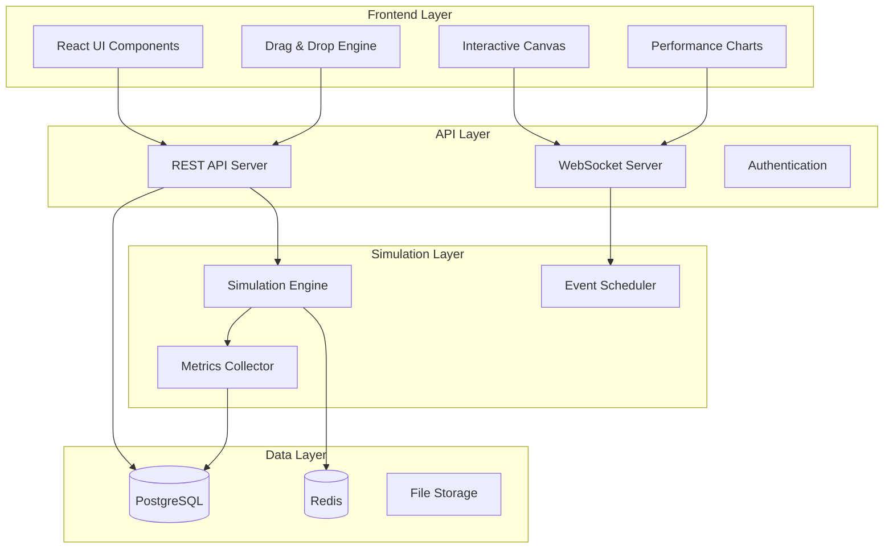

# Design Document: System Design Simulator

## Overview

The System Design Simulator is a web-based interactive learning platform that enables users to learn system design through hands-on experimentation. The platform features a drag-and-drop interface for building system architectures, real-time simulation capabilities, and comprehensive performance analytics. Users can create, configure, and test distributed system designs while receiving immediate feedback on performance characteristics and bottlenecks.

The platform follows a modern web architecture with a React-based frontend for the interactive canvas and a Node.js backend with WebSocket support for real-time simulation updates. The simulation engine uses discrete-event simulation principles to model realistic system behavior including load patterns, component failures, and performance metrics.

## Architecture

### High-Level Architecture



### Component Architecture

The system is organized into distinct layers with clear separation of concerns:

- **Presentation Layer**: React-based UI with drag-and-drop canvas using React DnD library
- **API Layer**: Express.js REST API with Socket.IO for real-time communication
- **Business Logic Layer**: Simulation engine with discrete-event scheduling
- **Data Layer**: PostgreSQL for persistence, Redis for caching and real-time data

## Components and Interfaces

### Frontend Components

#### Canvas Component
- **Purpose**: Main workspace for designing system architectures
- **Technology**: React with React DnD for drag-and-drop functionality
- **Key Features**:
  - Component palette with draggable system elements
  - Visual canvas with grid snapping and zoom capabilities
  - Connection system for wiring components together
  - Real-time visual feedback during simulation

#### Component Library
- **Purpose**: Provides draggable system design components
- **Components Include**:
  - Databases (SQL, NoSQL, Cache)
  - Load Balancers (Layer 4/7, algorithms)
  - Web Servers (Apache, Nginx, application servers)
  - Message Queues (Kafka, RabbitMQ, SQS)
  - CDNs and Proxy Servers
  - Monitoring and Logging services

#### Performance Dashboard
- **Purpose**: Real-time visualization of simulation metrics
- **Technology**: Chart.js or D3.js for interactive charts
- **Metrics Displayed**:
  - Latency percentiles (P50, P95, P99)
  - Throughput (requests per second)
  - Error rates and success rates
  - Resource utilization (CPU, memory, network)
  - Queue depths and processing times

### Backend Components

#### Simulation Engine
- **Purpose**: Core simulation logic for modeling system behavior
- **Architecture**: Event-driven discrete simulation
- **Key Responsibilities**:
  - Process simulation events in chronological order
  - Model component behavior based on configuration
  - Generate realistic load patterns and traffic
  - Calculate performance metrics and bottlenecks

#### Component Models
Each system component has a dedicated model class:

```typescript
interface ComponentModel {
  id: string;
  type: ComponentType;
  configuration: ComponentConfig;
  processRequest(request: SimulationRequest): Promise<SimulationResponse>;
  getMetrics(): ComponentMetrics;
  handleFailure(failureType: FailureType): void;
}
```

#### Event Scheduler
- **Purpose**: Manages simulation timeline and event processing
- **Implementation**: Priority queue for chronological event processing
- **Event Types**:
  - Request arrivals and departures
  - Component failures and recoveries
  - Configuration changes
  - Metric collection intervals

### API Interfaces

#### REST API Endpoints
```typescript
// Workspace Management
POST /api/workspaces - Create new workspace
GET /api/workspaces/:id - Load workspace
PUT /api/workspaces/:id - Save workspace
DELETE /api/workspaces/:id - Delete workspace

// Component Management
POST /api/workspaces/:id/components - Add component
PUT /api/workspaces/:id/components/:componentId - Update component
DELETE /api/workspaces/:id/components/:componentId - Remove component

// Simulation Control
POST /api/workspaces/:id/simulate - Start simulation
PUT /api/workspaces/:id/simulate - Update simulation parameters
DELETE /api/workspaces/:id/simulate - Stop simulation

// Scenarios and Templates
GET /api/scenarios - List available scenarios
GET /api/scenarios/:id - Load specific scenario
POST /api/templates - Save workspace as template
```

#### WebSocket Events
```typescript
// Real-time Simulation Updates
'simulation:started' - Simulation began
'simulation:metrics' - Real-time performance data
'simulation:event' - Significant simulation events
'simulation:completed' - Simulation finished
'simulation:error' - Simulation errors

// Canvas Updates
'canvas:component-added' - Component added to canvas
'canvas:component-updated' - Component configuration changed
'canvas:connection-created' - Components connected
'canvas:connection-removed' - Connection deleted
```

## Data Models

### Workspace Model
```typescript
interface Workspace {
  id: string;
  name: string;
  description?: string;
  userId: string;
  components: Component[];
  connections: Connection[];
  configuration: SimulationConfig;
  createdAt: Date;
  updatedAt: Date;
}
```

### Component Model
```typescript
interface Component {
  id: string;
  type: ComponentType;
  position: { x: number; y: number };
  configuration: ComponentConfig;
  metadata: {
    name: string;
    description?: string;
    version: string;
  };
}

type ComponentType = 
  | 'database' | 'load-balancer' | 'web-server' 
  | 'cache' | 'message-queue' | 'cdn' | 'proxy';

interface ComponentConfig {
  // Common properties
  capacity: number;
  latency: number;
  failureRate: number;
  
  // Type-specific properties
  [key: string]: any;
}
```

### Connection Model
```typescript
interface Connection {
  id: string;
  sourceComponentId: string;
  targetComponentId: string;
  sourcePort: string;
  targetPort: string;
  configuration: ConnectionConfig;
}

interface ConnectionConfig {
  bandwidth: number;
  latency: number;
  protocol: 'HTTP' | 'TCP' | 'UDP' | 'DATABASE';
  reliability: number;
}
```

### Simulation Configuration
```typescript
interface SimulationConfig {
  duration: number; // seconds
  loadPattern: LoadPattern;
  failureScenarios: FailureScenario[];
  metricsCollection: MetricsConfig;
}

interface LoadPattern {
  type: 'constant' | 'ramp' | 'spike' | 'realistic';
  baseLoad: number; // requests per second
  peakLoad?: number;
  pattern?: number[]; // Custom load curve
}
```

Now I need to use the prework tool to analyze the acceptance criteria before writing the correctness properties:

<function_calls>
<invoke name="prework">
<parameter name="featureName">system-design-simulator

## Correctness Properties

*A property is a characteristic or behavior that should hold true across all valid executions of a system—essentially, a formal statement about what the system should do. Properties serve as the bridge between human-readable specifications and machine-verifiable correctness guarantees.*

After analyzing the acceptance criteria, I've identified several key properties that can be consolidated to avoid redundancy. Many individual criteria can be combined into comprehensive properties that validate multiple related behaviors.

### Property Reflection

Before defining the final properties, I've reviewed all testable criteria from the prework analysis and identified opportunities for consolidation:

- **Drag-and-drop properties** (1.2, 1.3, 1.5) can be combined into a comprehensive component interaction property
- **Connection properties** (2.1, 2.2, 2.3, 2.5) can be unified into a wiring behavior property  
- **Parameter tuning properties** (3.1, 3.2, 3.3, 3.4) can be consolidated into a configuration management property
- **Simulation properties** (4.1, 4.3, 4.5) can be combined into a simulation execution property
- **Workspace persistence properties** (6.1, 6.2, 6.4) represent a classic round-trip property
- **Component modeling properties** (8.1-8.5) can be unified into a behavioral consistency property

### Core Properties

**Property 1: Component Drag-and-Drop Interaction**
*For any* component from the library and any valid canvas location, dragging the component to that location should result in the component appearing on the canvas at the correct position, being selectable, and displaying appropriate configuration options when selected.
**Validates: Requirements 1.2, 1.3, 1.5**

**Property 2: Multiple Component Instance Support**
*For any* component type, adding multiple instances to the canvas should result in all instances being independently selectable and configurable without interference.
**Validates: Requirements 1.4**

**Property 3: Component Connection Establishment**
*For any* two components with compatible connection points, creating a wire between them should establish a permanent connection with appropriate visual styling based on connection type, and allow configuration of connection properties.
**Validates: Requirements 2.1, 2.2, 2.4, 2.5**

**Property 4: Connection Validation**
*For any* attempted connection between components, the system should only allow connections between compatible component types and connection points, preventing invalid configurations.
**Validates: Requirements 2.3**

**Property 5: Parameter Configuration Management**
*For any* component and parameter type, selecting the component should display appropriate input controls for that parameter type, validate parameter values, and update component behavior in real-time during simulation.
**Validates: Requirements 3.1, 3.2, 3.3, 3.4**

**Property 6: Simulation Execution Consistency**
*For any* valid workspace configuration, starting a simulation should process the configuration, display real-time metrics during execution, and provide detailed reports upon completion.
**Validates: Requirements 4.1, 4.3, 4.5**

**Property 7: Load Pattern Generation**
*For any* specified load pattern type (constant, ramp, spike, realistic), the simulation engine should generate the appropriate traffic characteristics matching that pattern.
**Validates: Requirements 4.2**

**Property 8: Component Failure Modeling**
*For any* component type in the simulation, the system should be able to model failures and recovery scenarios while maintaining simulation integrity.
**Validates: Requirements 4.4**

**Property 9: Scenario Loading and Execution**
*For any* available learning scenario, selecting it should load the initial setup, display objectives, provide guidance during execution, and evaluate the solution upon completion.
**Validates: Requirements 5.2, 5.3, 5.4**

**Property 10: Progress Tracking Consistency**
*For any* sequence of completed scenarios, the system should accurately track progress and provide appropriate next-step suggestions.
**Validates: Requirements 5.5**

**Property 11: Workspace Persistence Round-Trip**
*For any* workspace state including components, connections, and configurations, saving and then loading the workspace should restore the exact same state.
**Validates: Requirements 6.1, 6.2, 6.4**

**Property 12: Workspace Export-Import Consistency**
*For any* workspace, exporting and then importing it should preserve all design elements and allow the imported workspace to function identically to the original.
**Validates: Requirements 6.3, 6.5**

**Property 13: Performance Visualization Completeness**
*For any* running simulation, the system should display real-time dashboards, interactive charts, bottleneck highlights, and generate comprehensive performance reports.
**Validates: Requirements 7.1, 7.2, 7.3, 7.5**

**Property 14: Design Iteration Comparison**
*For any* set of workspace iterations, the system should enable performance comparison across all iterations with meaningful metrics and insights.
**Validates: Requirements 7.4**

**Property 15: Component Behavioral Consistency**
*For any* component type (database, load balancer, cache, network, server), the simulation engine should model realistic behavior characteristics appropriate to that component type across all instances.
**Validates: Requirements 8.1, 8.2, 8.3, 8.4, 8.5**

## Error Handling

### Client-Side Error Handling

**Canvas Errors**:
- Invalid component drops outside canvas boundaries
- Attempting to connect incompatible components
- Dragging components beyond canvas limits
- Network connectivity issues during real-time updates

**Validation Errors**:
- Invalid parameter values (negative latencies, impossible throughput)
- Circular dependencies in component connections
- Resource constraints exceeded (too many components)
- Malformed workspace configurations

**User Experience Errors**:
- Graceful degradation when WebSocket connection fails
- Offline mode with limited functionality
- Auto-recovery from temporary network issues
- Clear error messages with suggested remediation

### Server-Side Error Handling

**Simulation Errors**:
- Component model failures during simulation
- Resource exhaustion (memory, CPU limits)
- Invalid simulation configurations
- Timeout handling for long-running simulations

**Data Persistence Errors**:
- Database connection failures
- Workspace corruption detection and recovery
- Concurrent modification conflicts
- Storage quota exceeded

**API Error Responses**:
```typescript
interface ErrorResponse {
  error: {
    code: string;
    message: string;
    details?: any;
    timestamp: string;
    requestId: string;
  };
}
```

### Failure Recovery Strategies

**Simulation Recovery**:
- Checkpoint-based simulation state saving
- Automatic retry with exponential backoff
- Graceful degradation to simplified models
- User notification with recovery options

**Data Recovery**:
- Automatic workspace backups every 5 minutes
- Version history for workspace recovery
- Export functionality as backup mechanism
- Conflict resolution for concurrent edits

## Testing Strategy

### Dual Testing Approach

The system requires both unit testing and property-based testing to ensure comprehensive coverage:

**Unit Tests**: Focus on specific examples, edge cases, and integration points
- Component rendering and interaction
- API endpoint functionality
- Database operations
- WebSocket message handling
- Error condition handling

**Property Tests**: Verify universal properties across all inputs using fast-check library
- Drag-and-drop behavior across all component types
- Connection validation for all component combinations
- Parameter validation for all input ranges
- Simulation consistency across all workspace configurations
- Workspace persistence across all possible states

### Property-Based Testing Configuration

**Framework**: fast-check for TypeScript/JavaScript property-based testing
**Test Configuration**: Minimum 100 iterations per property test
**Test Tagging**: Each property test must reference its design document property

Example test structure:
```typescript
// Feature: system-design-simulator, Property 1: Component Drag-and-Drop Interaction
fc.assert(fc.property(
  fc.record({
    componentType: fc.constantFrom('database', 'load-balancer', 'web-server'),
    position: fc.record({ x: fc.integer(0, 1000), y: fc.integer(0, 1000) })
  }),
  (testData) => {
    // Test drag-and-drop behavior
    const result = dragComponentToCanvas(testData.componentType, testData.position);
    expect(result.component.position).toEqual(testData.position);
    expect(result.component.selectable).toBe(true);
    expect(result.configurationOptions).toBeDefined();
  }
), { numRuns: 100 });
```

### Integration Testing

**End-to-End Scenarios**:
- Complete workspace creation and simulation workflow
- Multi-user collaboration scenarios
- Performance under realistic load conditions
- Cross-browser compatibility testing

**Performance Testing**:
- Canvas performance with large numbers of components
- Simulation engine scalability testing
- Real-time update performance under load
- Memory usage optimization validation

### Testing Coverage Requirements

**Unit Test Coverage**: Minimum 80% code coverage for all modules
**Property Test Coverage**: All 15 correctness properties must have corresponding property tests
**Integration Test Coverage**: All major user workflows covered
**Performance Test Coverage**: All performance-critical paths validated

The testing strategy ensures that both specific functionality works correctly (unit tests) and that universal properties hold across all possible inputs (property tests), providing comprehensive validation of system correctness.