# Design Document: Enhanced System Design Simulator SaaS Platform

## Overview

The System Design Simulator is a comprehensive SaaS-based interactive learning platform that enables users to learn system design from one user to one billion users through hands-on simulation and experimentation. The platform works like "Tinkercad for system design" but with a unique focus on teaching causality, tradeoffs, and engineering intuition through real-time simulation rather than static diagrams.

### Core Value Proposition

The platform addresses the critical gap in system design education by providing experiential learning through realistic simulation. Unlike static diagram tools, it teaches the "why" behind architectural decisions through:

- **Causality Teaching**: Clear cause-and-effect relationships between design choices and system behavior
- **Tradeoff Visualization**: Real-time demonstration of performance vs cost vs reliability tradeoffs  
- **Engineering Intuition**: Hands-on experience with scaling challenges from 1 to 1 billion users
- **Realistic Constraints**: Industry-standard failure modes and operational challenges

### Target User Classes

The platform serves five distinct user classes with tailored experiences:

1. **Learners**: Students and job-seekers learning system design fundamentals
   - Progressive curriculum from single-server to distributed systems
   - Guided scenarios based on real-world systems (Twitter, WhatsApp, Netflix, UPI)
   - Achievement tracking and skill assessment

2. **Engineers**: Practicing engineers experimenting with architectures
   - Advanced simulation capabilities with realistic failure injection
   - Cost modeling and optimization recommendations
   - Collaboration features for team architecture discussions

3. **Instructors**: Teachers creating guided scenarios and curricula
   - Instructor Mode with attention guidance and control takeover
   - Scenario creation tools with learning objective tracking
   - Student progress monitoring and analytics dashboards

4. **Interview Candidates**: Users practicing system design interviews
   - Interview Mode with timers and hidden challenges
   - Post-simulation critique with industry best practice comparisons
   - Scoring system aligned with interview evaluation criteria

5. **Administrators**: Platform operators managing the SaaS service
   - Multi-tenant management and resource allocation
   - Usage analytics and learning effectiveness metrics
   - System performance monitoring and optimization

### Platform Features

The platform features a Visual System Builder with specific industry-standard components (Client, Load Balancer, API Gateway, Service, Cache, Queue, Database, CDN, Search Index, Object Storage), where every wire has configurable latency, bandwidth, and retry policies. A single Traffic & Scale Simulator slider scales from 1 → 1K → 1M → 1B users, providing real-time visual feedback with color-coded bottleneck detection. Users can inject real-world constraints and failures to test system resilience.

The system supports multiple learning modes including Free Play, Guided Scenarios (Twitter Feed, WhatsApp Messaging, Netflix Streaming, UPI Payments), Interview Mode with timers and hidden challenges, and Instructor Mode for live teaching. Core backend engines include a System Graph Engine modeling DAGs with capacity curves, a Load Simulation Engine using queueing theory, a Distributed Systems Behavior Library, and a Cost Modeling Engine with live bankruptcy warnings.

The platform features multiplayer collaboration similar to Figma, scenario sharing, and public templates, all built on a multi-tenant SaaS architecture designed to serve thousands of concurrent learners while teaching the fundamental principles of scalable system design through experiential learning focused on causality and engineering intuition.

## Architecture

### High-Level Enhanced SaaS Architecture

The architecture follows a microservices pattern optimized for multi-tenant SaaS delivery with emphasis on scalability, security, and educational effectiveness:

```mermaid
graph TB
    subgraph "CDN & Edge Layer"
        CDN[Global CDN]
        Edge[Edge Servers]
        LB[Load Balancer]
    end
    
    subgraph "API Gateway & Security"
        Gateway[API Gateway]
        AuthSvc[Auth Service]
        RateLimit[Rate Limiting]
        Security[Security Layer]
    end
    
    subgraph "Frontend Layer"
        UI[React UI Components]
        Canvas[Interactive Canvas]
        DnD[Drag & Drop Engine]
        Charts[Performance Charts]
        Collab[Collaboration UI]
        Learning[Learning Interface]
    end
    
    subgraph "Core Microservices"
        UserSvc[User Service]
        WorkspaceSvc[Workspace Service]
        SimSvc[Simulation Service]
        CurriculumSvc[Curriculum Service]
        AnalyticsSvc[Analytics Service]
        CollabSvc[Collaboration Service]
        TenantSvc[Tenant Service]
    end
    
    subgraph "Core Backend Engines"
        SGE[System Graph Engine]
        LSE[Load Simulation Engine]
        DSBL[Distributed Systems Library]
        CME[Cost Modeling Engine]
        Scheduler[Event Scheduler]
        Metrics[Metrics Collector]
    end
    
    subgraph "Data Layer"
        UserDB[(User Database)]
        WorkspaceDB[(Workspace Database)]
        AnalyticsDB[(Analytics Database)]
        TenantDB[(Tenant Database)]
        Cache[(Redis Cache)]
        FileStore[File Storage]
        MessageQueue[Message Queue]
        SearchIndex[Search Engine]
    end
    
    subgraph "Infrastructure & Operations"
        Monitor[Monitoring & Logging]
        Backup[Backup & Recovery]
        AutoScale[Auto Scaling]
        Compliance[Security & Compliance]
    end
    
    CDN --> LB
    LB --> Gateway
    Gateway --> Security
    Security --> AuthSvc
    
    UI --> Gateway
    Canvas --> Gateway
    Collab --> Gateway
    Learning --> Gateway
    
    Gateway --> UserSvc
    Gateway --> WorkspaceSvc
    Gateway --> SimSvc
    Gateway --> CurriculumSvc
    Gateway --> AnalyticsSvc
    Gateway --> CollabSvc
    Gateway --> TenantSvc
    
    SimSvc --> SGE
    SimSvc --> LSE
    SimSvc --> DSBL
    SimSvc --> CME
    SGE --> Scheduler
    LSE --> Metrics
    
    UserSvc --> UserDB
    WorkspaceSvc --> WorkspaceDB
    AnalyticsSvc --> AnalyticsDB
    TenantSvc --> TenantDB
    SimSvc --> Cache
    CollabSvc --> MessageQueue
    CurriculumSvc --> SearchIndex
    
    Monitor --> UserSvc
    Monitor --> WorkspaceSvc
    Monitor --> SimSvc
    AutoScale --> SimSvc
    Backup --> UserDB
    Backup --> WorkspaceDB
```



### Non-Functional Requirements Architecture

The architecture is designed to meet specific non-functional requirements from the SRS:

**Performance Requirements**:
- **100ms Simulation Updates**: Achieved through optimized Core Backend Engines and efficient WebSocket communication
- **Real-time UI Responsiveness**: React-based frontend with optimistic updates and conflict resolution
- **Concurrent User Isolation**: Multi-tenant architecture with resource quotas and isolated execution contexts

**Scalability Requirements**:
- **Thousands of Concurrent Users**: Horizontal scaling of microservices with auto-scaling capabilities
- **Simulation Engine Scaling**: Dedicated compute clusters for simulation workloads with queue management
- **Database Scaling**: Sharded multi-tenant database architecture with read replicas

**Reliability Requirements**:
- **User Isolation**: Strict tenant boundaries with encrypted data separation
- **Partial Failure Recovery**: Circuit breakers and graceful degradation across all services
- **Reliable Persistence**: Multi-region data replication with automated backup and recovery

**Security Requirements**:
- **Access-Controlled Data**: Role-based access control (RBAC) with tenant-scoped permissions
- **Private by Default**: All user data private unless explicitly shared with granular permissions
- **Secure Authentication**: Multi-provider OAuth with JWT tokens and session management

**Usability Requirements**:
- **Intuitive UI**: Progressive disclosure with contextual help and guided onboarding
- **Clear Failure Feedback**: Detailed error messages with suggested remediation actions
- **Keyboard/Mouse Support**: Full accessibility compliance with keyboard navigation

**Maintainability Requirements**:
- **Modular Components**: Microservices architecture with clear API boundaries
- **Extensible Design**: Plugin architecture for new component types and simulation models
- **Non-Breaking Extensions**: Versioned APIs and backward compatibility guarantees

### Core Backend Engines Architecture

The platform is built around four specialized backend engines that provide the unique value proposition of teaching causality, tradeoffs, and engineering intuition:

#### System Graph Engine (SGE)
- **Purpose**: Models system components as a directed acyclic graph with realistic performance characteristics
- **Technology**: Go for high-performance graph operations and concurrent processing
- **Key Features**:
  - DAG representation with capacity limits, latency curves, and throughput limits per component
  - End-to-end latency calculation by traversing graph and summing processing times
  - Realistic degradation modeling when capacity is exceeded (increased latency, dropped requests, cascading failures)
  - Circular dependency detection and prevention
  - Dynamic reconfiguration during simulation without restart

#### Load Simulation Engine (LSE)
- **Purpose**: Generates realistic traffic patterns using queueing theory and models backpressure propagation
- **Technology**: Rust for high-performance concurrent simulation with deterministic results
- **Key Features**:
  - Poisson arrival processes with configurable lambda values based on user scale selection
  - Backpressure propagation through system graph when components reach capacity
  - Queueing theory calculations (M/M/1, M/M/c queues) for wait times and queue lengths
  - Realistic overflow behavior (request dropping, circuit breaker activation)
  - Burst traffic patterns and gradual ramp-up scenarios

#### Distributed Systems Behavior Library (DSBL)
- **Purpose**: Models realistic distributed systems behaviors for educational purposes
- **Technology**: TypeScript with pluggable behavior modules for different consistency models
- **Key Features**:
  - Database consistency levels (strong, eventual, weak) with performance/availability tradeoffs
  - Replication lag and split-brain scenario simulation
  - Sharding strategies (range-based, hash-based, directory-based) with hotspot detection
  - Network partition simulation and impact on availability/consistency
  - Consensus algorithms (Raft, PBFT) for distributed coordination

#### Cost Modeling Engine (CME)
- **Purpose**: Provides real-time cost implications with bankruptcy warnings to teach cost-performance tradeoffs
- **Technology**: Node.js with real-time pricing data integration from major cloud providers
- **Key Features**:
  - Real-time cost calculation based on component types, instance sizes, data transfer, storage
  - Live cost meter with monthly projection and component-level breakdown
  - Configurable bankruptcy warnings and cost optimization suggestions
  - Realistic cloud pricing models (compute, storage, network, managed services)
  - Cost comparison views showing architectural change impacts

### Enhanced Multi-Tenant Architecture Design

The platform implements a hybrid multi-tenancy model:

- **Shared Infrastructure**: All tenants share the same application instances and infrastructure
- **Data Isolation**: Each tenant's data is logically separated using tenant IDs and access controls
- **Resource Quotas**: Per-tenant limits on workspaces, simulations, and storage
- **Customization**: Tenant-specific branding and feature configurations

### Scalability Architecture

The system is designed to handle thousands of concurrent users with auto-scaling capabilities:

- **Horizontal Scaling**: Microservices can scale independently based on demand
- **Simulation Scaling**: Dedicated simulation clusters for compute-intensive operations
- **Database Sharding**: User and workspace data partitioned across multiple database instances
- **Caching Strategy**: Multi-layer caching for frequently accessed data and simulation results

## Components and Interfaces

### Frontend Components

### Enhanced Frontend Components

#### Authentication Components
- **Purpose**: Handle comprehensive user authentication and account management for all user classes
- **Technology**: React with Auth0 or Firebase Auth integration supporting multiple providers
- **Key Features**:
  - **Multi-Provider Authentication**: Email/password, Google OAuth, GitHub OAuth with seamless switching
  - **User Class Onboarding**: Tailored registration flows for Learners, Engineers, Instructors, Interview Candidates
  - **Account Management**: Password reset, email verification, profile management with learning preferences
  - **Session Management**: Secure JWT tokens with automatic refresh and cross-device synchronization
  - **Tenant Integration**: Automatic tenant assignment and organization invitation handling

#### Visual System Builder
- **Purpose**: Enhanced drag-and-drop interface implementing SRS FR-2 (Visual System Design Canvas)
- **Technology**: React with React DnD and custom canvas rendering optimized for performance
- **Key Features**:
  - **Component Library**: Exactly 10 specific components (Client, Load Balancer, API Gateway, Service, Cache, Queue, Database, CDN, Search Index, Object Storage) per SRS FR-3
  - **Visual Canvas**: Grid snapping, zoom, pan, component-specific icons with capacity indicators
  - **Connection System**: Enhanced wiring with latency, bandwidth, retry policies per SRS requirements
  - **Parameter Configuration**: Component-specific configuration panels with validation and presets
  - **Invalid Connection Prevention**: Smart validation preventing incompatible component connections
  - **Component Grouping**: Visual grouping and labeling for complex architectures

#### Traffic & Scale Simulator
- **Purpose**: Implements SRS FR-5 (Scale Control) with single slider from 1 user to 1 billion users
- **Technology**: React with D3.js for real-time visualizations and WebSocket for sub-100ms updates
- **Key Features**:
  - **Logarithmic Scale Control**: Precise control points at 1, 1K, 1M, 1B users with smooth interpolation
  - **Real-Time Metrics**: QPS, concurrent connections, data volume, cache hit ratios, queue depth, disk IOPS, network saturation
  - **Performance Visualization**: Sub-100ms update guarantee with optimized rendering pipeline
  - **Bottleneck Detection**: Automatic identification and highlighting of system bottlenecks
  - **System Collapse Detection**: Early warning system for impending system failures

#### Bottleneck Visualizer
- **Purpose**: Implements SRS FR-7 (Metrics & Observability Dashboard) with real-time visual feedback
- **Technology**: React with Canvas API for high-performance rendering and WebGL acceleration
- **Key Features**:
  - **Color-Coded States**: Green (healthy), yellow (stressed), red (bottleneck), black (failed) with smooth transitions
  - **Detailed Metrics**: Latency percentiles (p50/p95/p99), error rates, throughput, resource saturation
  - **Node-Specific Metrics**: CPU %, memory %, network %, disk I/O % with drill-down capabilities
  - **Global System View**: End-to-end performance visualization with dependency mapping
  - **Historical Trending**: Performance trends over time with anomaly detection

#### Constraint Injector Interface
- **Purpose**: Implements SRS FR-6 (Failure & Constraint Injection) for realistic failure scenarios
- **Technology**: React with real-time control panels and constraint configuration
- **Key Features**:
  - **Failure Types**: Component failures, latency injection, network partitions, regional outages per SRS
  - **Configurable Parameters**: Severity levels, duration controls, recovery behavior modeling
  - **Observable Recovery**: Visual feedback on system recovery and adaptation mechanisms
  - **Chaos Engineering**: Random failure injection with configurable chaos parameters
  - **Failure Scenarios**: Predefined failure patterns based on real-world incidents

#### Learning Modes Interface
- **Purpose**: Implements SRS FR-9 (Learning & Scenario Mode) with comprehensive educational features
- **Technology**: React with mode-specific UI components and adaptive content delivery
- **Key Features**:
  - **Free Play Mode**: Unlimited component access with no constraints for experimentation
  - **Guided Scenarios**: Predefined scenarios with progressive constraints and hints per SRS
  - **Interview Mode**: Timed challenges with hidden constraints and performance evaluation
  - **Instructor Mode**: Live teaching interface with student attention management and control
  - **Progress Tracking**: Completion tracking, skill assessment, and achievement systems
  - **Hint System**: Contextual explanations and progressive disclosure of complexity

#### Cost Modeling Dashboard
- **Purpose**: Implements SRS FR-8 (Cost Modeling Engine) with real-time cost visualization
- **Technology**: React with real-time charts integrated with cloud pricing APIs
- **Key Features**:
  - **Live Cost Tracking**: Real-time cost calculation with compute, storage, network breakdown
  - **Scale-Based Costing**: Cost implications at different user scales with optimization suggestions
  - **Performance Tradeoffs**: Interactive cost vs performance analysis with recommendation engine
  - **Budget Alerts**: Configurable cost thresholds with bankruptcy warnings and mitigation strategies
  - **Cloud Provider Integration**: Realistic pricing models from AWS, GCP, Azure with regular updates

#### Multiplayer Canvas
- **Purpose**: Implements SRS FR-10 (Collaboration) with Figma-like real-time collaboration
- **Technology**: React with Operational Transformation, WebSocket, and conflict resolution
- **Key Features**:
  - **Real-Time Editing**: Multi-user simultaneous editing with sub-100ms synchronization
  - **Collaborative Cursors**: User presence indicators with names, colors, and selection states
  - **Conflict Resolution**: Operational transformation for concurrent edits without data loss
  - **Version History**: Complete edit history with rollback capabilities and branch management
  - **Instructor Controls**: Attention guidance, screen sharing, and session management for teaching
  - **Permission Management**: Granular sharing controls with viewer/editor/admin roles

### Enhanced Backend Microservices

#### User Service
- **Purpose**: Implements SRS FR-1 (User Authentication & Account Management) with comprehensive multi-tenant support
- **Technology**: Node.js with Express, JWT, and multi-provider OAuth integration
- **Key Responsibilities**:
  - **User Registration**: Email verification, OAuth provider integration, user class identification
  - **Authentication**: Multi-provider login (email, Google, GitHub), session management, token refresh
  - **Account Management**: Profile updates, password reset, account deletion with data cleanup
  - **Tenant Integration**: Automatic tenant assignment, organization invitations, role management
  - **Subscription Management**: Free/paid tier handling, billing integration, usage tracking
  - **User Preferences**: Learning pace, difficulty preferences, notification settings, theme management

#### Workspace Service
- **Purpose**: Implements workspace management with enhanced collaboration per SRS FR-10
- **Technology**: Node.js with Express, MongoDB, and real-time synchronization
- **Key Responsibilities**:
  - **Workspace CRUD**: Create, read, update, delete with strict tenant isolation and access controls
  - **Version Control**: Complete edit history, branching, merging, rollback capabilities
  - **Collaboration**: Real-time multi-user editing with operational transformation and conflict resolution
  - **Template Management**: Public/private templates, community gallery, rating and review system
  - **Sharing Controls**: Granular permissions (viewer/editor/admin), team workspace management
  - **Import/Export**: Full workspace serialization with configuration preservation

#### Enhanced Simulation Service
- **Purpose**: Orchestrates all Core Backend Engines implementing SRS FR-4 (Traffic & Load Simulation)
- **Technology**: Node.js with worker processes and dedicated compute clusters for simulation workloads
- **Key Responsibilities**:
  - **Engine Orchestration**: Coordinates System Graph Engine, Load Simulation Engine, DSBL, and Cost Modeling Engine
  - **Simulation Lifecycle**: Start, pause, resume, stop with checkpoint-based state management
  - **Resource Management**: Simulation queuing, resource allocation, concurrent simulation limits
  - **Results Processing**: Real-time metrics aggregation, bottleneck analysis, performance reporting
  - **Scale Simulation**: Handles 1 user to 1 billion user simulations with realistic performance modeling
  - **Failure Injection**: Coordinates constraint injection across all engines with recovery monitoring

#### Curriculum Service
- **Purpose**: Implements SRS FR-9 (Learning & Scenario Mode) with adaptive learning capabilities
- **Technology**: Node.js with machine learning integration (TensorFlow.js) and content management
- **Key Responsibilities**:
  - **Learning Path Management**: Structured progression from beginner to advanced system design
  - **Scenario Orchestration**: Predefined scenarios (Twitter, WhatsApp, Netflix, UPI) with progressive complexity
  - **Adaptive Learning**: Personalized content recommendations based on user performance and learning patterns
  - **Skill Assessment**: Competency evaluation focusing on causality understanding and tradeoff analysis
  - **Progress Tracking**: Achievement systems, milestone management, streak tracking, completion analytics
  - **Content Delivery**: Contextual hints, explanations, and progressive disclosure of complexity

#### Enhanced Analytics Service
- **Purpose**: Comprehensive learning and platform analytics per SRS requirements
- **Technology**: Node.js with Apache Kafka for event streaming and ML analytics pipeline
- **Key Responsibilities**:
  - **Learning Analytics**: Detailed tracking of user decision-making patterns and engineering intuition development
  - **Performance Metrics**: Platform usage, simulation performance, user engagement, learning effectiveness
  - **Personalization Data**: ML model training data for adaptive content and recommendation systems
  - **Instructor Dashboards**: Student progress monitoring, engagement analytics, learning outcome tracking
  - **Platform Analytics**: Multi-tenant usage patterns, resource utilization, cost optimization insights
  - **A/B Testing**: Learning effectiveness experiments and feature rollout analytics

#### Enhanced Collaboration Service
- **Purpose**: Implements SRS FR-10 (Collaboration) with comprehensive real-time features
- **Technology**: Node.js with Socket.IO, Redis, Operational Transformation, and WebRTC integration
- **Key Responsibilities**:
  - **Real-Time Editing**: Multi-user simultaneous editing with sub-100ms synchronization and conflict resolution
  - **Presence Management**: User cursors, selection states, active participant tracking, session management
  - **Instructor Features**: Attention guidance, screen sharing, session control, student progress monitoring
  - **Communication**: Integrated voice/video calls, text chat, annotation system, discussion threads
  - **Community Features**: Public template gallery, rating system, discussion forums, knowledge sharing
  - **Notification System**: Real-time updates, collaboration invites, achievement notifications

#### Tenant Service
- **Purpose**: Multi-tenant architecture management implementing comprehensive SaaS requirements
- **Technology**: Node.js with Express and tenant-scoped database operations
- **Key Responsibilities**:
  - **Tenant Management**: Organization creation, member management, role-based access control
  - **Resource Quotas**: Workspace limits, simulation quotas, storage limits, compute time tracking
  - **Billing Integration**: Subscription management, usage tracking, billing cycle management
  - **Data Isolation**: Strict tenant boundaries, encrypted data separation, access audit logging
  - **Organization Features**: Team workspaces, shared resources, collaborative learning environments

### Enhanced Component Library with SRS Compliance

The platform provides exactly 10 specific system design components per SRS FR-3, each with realistic behavior modeling and scale-aware characteristics:

#### Component Specifications

**Client Component**:
- **Purpose**: User interface and client-side logic with session management
- **Capacity Limits**: Concurrent sessions, bandwidth consumption, local storage
- **Scaling Characteristics**: Horizontal scaling through load distribution
- **Configuration Options**: Session timeout, caching strategy, connection pooling
- **Failure Modes**: Network connectivity issues, session expiration, local storage limits

**Load Balancer Component**:
- **Purpose**: Layer 4/7 load balancing with multiple algorithms
- **Algorithms**: Round-robin, least connections, weighted, consistent hashing, IP hash
- **Capacity Limits**: Connections per second, bandwidth throughput, health check frequency
- **Scaling Characteristics**: Active-passive or active-active configurations
- **Configuration Options**: Health check parameters, sticky sessions, SSL termination
- **Failure Modes**: Backend server failures, health check timeouts, capacity overload

**API Gateway Component**:
- **Purpose**: Rate limiting, authentication, request routing, protocol translation
- **Capacity Limits**: Requests per second, concurrent connections, transformation overhead
- **Scaling Characteristics**: Horizontal scaling with shared configuration
- **Configuration Options**: Rate limiting rules, authentication methods, routing policies
- **Failure Modes**: Rate limit exceeded, authentication failures, backend timeouts

**Service Component**:
- **Purpose**: Application logic with CPU, memory, and concurrent request handling
- **Capacity Limits**: CPU utilization, memory consumption, concurrent request limits
- **Scaling Characteristics**: Horizontal and vertical scaling options
- **Configuration Options**: Instance size, auto-scaling policies, resource limits
- **Failure Modes**: CPU exhaustion, memory leaks, request queue overflow

**Cache Component**:
- **Purpose**: In-memory caching with configurable eviction policies
- **Eviction Policies**: LRU (Least Recently Used), LFU (Least Frequently Used), TTL (Time To Live)
- **Capacity Limits**: Memory size, key count, network bandwidth
- **Scaling Characteristics**: Distributed caching with sharding and replication
- **Configuration Options**: Cache size, eviction policy, TTL settings, hit ratio targets
- **Failure Modes**: Memory exhaustion, cache misses, network partitions

**Queue Component**:
- **Purpose**: Message queuing with different patterns and durability guarantees
- **Messaging Patterns**: FIFO, priority queues, pub/sub, dead letter queues
- **Capacity Limits**: Message throughput, queue depth, message size limits
- **Scaling Characteristics**: Partitioned queues with consumer groups
- **Configuration Options**: Durability settings, retention policies, consumer configurations
- **Failure Modes**: Queue overflow, consumer lag, message loss, poison messages

**Database Component**:
- **Purpose**: Data persistence with ACID properties and query processing
- **Database Types**: Relational (ACID), NoSQL (eventual consistency), time-series
- **Capacity Limits**: Connections, IOPS, storage capacity, query complexity
- **Scaling Characteristics**: Read replicas, sharding, clustering
- **Configuration Options**: Consistency levels, replication factor, indexing strategies
- **Failure Modes**: Connection exhaustion, disk space, replication lag, deadlocks

**CDN Component**:
- **Purpose**: Content delivery with geographic distribution and edge caching
- **Geographic Distribution**: Multiple edge locations with cache hierarchies
- **Capacity Limits**: Bandwidth per edge, cache storage, origin pull capacity
- **Scaling Characteristics**: Automatic edge scaling based on demand
- **Configuration Options**: Cache policies, TTL settings, origin configuration
- **Failure Modes**: Origin server failures, cache misses, edge server overload

**Search Index Component**:
- **Purpose**: Full-text search with indexing and relevance scoring
- **Index Types**: Full-text, faceted search, geospatial, time-based
- **Capacity Limits**: Index size, query throughput, indexing latency
- **Scaling Characteristics**: Distributed indexing with sharding and replication
- **Configuration Options**: Indexing strategies, relevance scoring, query optimization
- **Failure Modes**: Index corruption, query timeouts, relevance degradation

**Object Storage Component**:
- **Purpose**: Scalable object storage with consistency models and multi-part uploads
- **Consistency Models**: Strong consistency, eventual consistency, read-after-write
- **Capacity Limits**: Storage capacity, bandwidth, request rate limits
- **Scaling Characteristics**: Automatic scaling with geographic replication
- **Configuration Options**: Consistency level, replication settings, lifecycle policies
- **Failure Modes**: Storage exhaustion, network partitions, consistency conflicts

#### Component Interaction Matrix

Each component type has defined compatibility rules for connections:

```typescript
interface ComponentCompatibility {
  validConnections: {
    [sourceType: string]: {
      [targetType: string]: {
        connectionTypes: ConnectionType[];
        latencyRange: [number, number]; // ms
        bandwidthRange: [number, number]; // Mbps
        retryPolicies: RetryPolicy[];
      }
    }
  };
}

// Example: Load Balancer can connect to Services with specific parameters
const compatibility: ComponentCompatibility = {
  validConnections: {
    'LoadBalancer': {
      'Service': {
        connectionTypes: ['HTTP', 'HTTPS', 'TCP'],
        latencyRange: [1, 50], // 1-50ms typical for internal network
        bandwidthRange: [100, 10000], // 100Mbps to 10Gbps
        retryPolicies: ['exponential-backoff', 'circuit-breaker', 'none']
      }
    }
  }
};
```

### User Class-Specific Features

The platform provides tailored experiences for each of the five user classes identified in the SRS:

#### Learner Experience
- **Progressive Curriculum**: Structured learning path from single-server to distributed systems
- **Guided Scenarios**: Step-by-step tutorials for Twitter Feed, WhatsApp Messaging, Netflix Streaming, UPI Payments
- **Achievement System**: Skill-based achievements focusing on causality understanding and engineering intuition
- **Adaptive Difficulty**: Content difficulty adjusts based on performance and learning velocity
- **Peer Learning**: Community features for collaborative learning and knowledge sharing

#### Engineer Experience  
- **Advanced Simulation**: Full access to all Core Backend Engines with realistic failure injection
- **Cost Optimization**: Detailed cost modeling with optimization recommendations and tradeoff analysis
- **Collaboration Tools**: Team workspaces for architecture discussions and design reviews
- **Custom Scenarios**: Ability to create and share custom simulation scenarios
- **Performance Analysis**: Deep dive analytics into system performance and bottleneck identification

#### Instructor Experience
- **Instructor Mode**: Real-time control over student sessions with attention guidance
- **Curriculum Management**: Tools for creating custom learning paths and scenarios
- **Student Analytics**: Comprehensive dashboards showing student progress and engagement
- **Live Teaching**: Integrated voice/video for remote instruction with screen sharing
- **Assessment Tools**: Skill evaluation and progress tracking across multiple students

#### Interview Candidate Experience
- **Interview Mode**: Timed challenges with hidden constraints and performance pressure
- **Industry Scenarios**: Realistic system design problems from major tech companies
- **Performance Evaluation**: Scoring system aligned with industry interview criteria
- **Practice Sessions**: Unlimited practice with immediate feedback and improvement suggestions
- **Mock Interviews**: Simulated interview environment with realistic time constraints

#### Administrator Experience
- **Multi-Tenant Management**: Organization and user management with resource allocation
- **Platform Analytics**: Usage patterns, learning effectiveness, and system performance metrics
- **Resource Monitoring**: Real-time monitoring of simulation workloads and system health
- **Billing Integration**: Subscription management and usage-based billing
- **Security Management**: Access controls, audit logging, and compliance reporting

#### Multi-Scale Simulation Engine
- **Purpose**: Model system behavior across different user scales
- **Architecture**: Hierarchical simulation with scale-specific optimizations
- **Key Features**:
  - Adaptive simulation granularity based on scale
  - Realistic bottleneck modeling (database connections, network bandwidth)
  - Cost calculation integration with cloud pricing models
  - Failure scenario generation at scale

#### Component Models with Scale Awareness
Each system component includes scale-specific behavior modeling:

```typescript
interface ScalableComponentModel extends ComponentModel {
  scaleCharacteristics: ScaleCharacteristics;
  calculatePerformanceAtScale(userCount: number): PerformanceMetrics;
  identifyBottlenecksAtScale(userCount: number): Bottleneck[];
  suggestScalingStrategies(targetScale: number): ScalingStrategy[];
}

interface ScaleCharacteristics {
  maxConcurrentUsers: number;
  scalingType: 'vertical' | 'horizontal' | 'both';
  costModel: CostModel;
  bottleneckThresholds: BottleneckThreshold[];
}
```

#### Learning Analytics Engine
- **Purpose**: Track learning progress and provide personalized recommendations
- **Technology**: Machine learning models for pattern recognition
- **Key Features**:
  - Skill progression tracking across scalability concepts
  - Common mistake identification and remediation
  - Personalized learning path optimization
  - Peer comparison and collaborative learning insights

### API Interfaces

#### Authentication & User Management APIs
```typescript
// User Authentication implementing SRS FR-1
POST /api/auth/register - User registration with email verification and user class identification
POST /api/auth/login - Multi-provider login (email, Google, GitHub) with session establishment
POST /api/auth/logout - Secure logout with session cleanup and token invalidation
POST /api/auth/refresh - JWT token refresh with security validation
POST /api/auth/reset-password - Password reset flow with secure token generation
POST /api/auth/verify-email - Email verification with account activation

// User Profile Management
GET /api/users/profile - Get comprehensive user profile including learning preferences and progress
PUT /api/users/profile - Update user profile with validation and tenant-scoped changes
GET /api/users/progress - Get detailed learning progress, achievements, and skill assessments
PUT /api/users/preferences - Update learning preferences (pace, difficulty, notifications, theme)
DELETE /api/users/account - Account deletion with complete data cleanup and retention compliance
GET /api/users/subscription - Get subscription status and billing information
PUT /api/users/subscription - Update subscription tier and billing preferences
```

#### Multi-Tenant Workspace APIs
```typescript
// Workspace Management implementing SRS FR-2 with tenant isolation
POST /api/workspaces - Create new workspace with tenant-scoped access and resource quota validation
GET /api/workspaces - List user's workspaces with tenant filtering and permission-based access
GET /api/workspaces/:id - Load workspace with comprehensive tenant validation and access control
PUT /api/workspaces/:id - Save workspace with tenant-scoped changes and version control
DELETE /api/workspaces/:id - Delete workspace with tenant-scoped cleanup and audit logging
GET /api/workspaces/:id/history - Get complete version history with rollback capabilities
POST /api/workspaces/:id/rollback - Rollback to specific version with conflict resolution

// Collaboration APIs implementing SRS FR-10
POST /api/workspaces/:id/share - Share workspace with granular permissions (viewer/editor/admin)
PUT /api/workspaces/:id/collaborate - Enable real-time collaboration with operational transformation
GET /api/workspaces/:id/collaborators - List workspace collaborators with presence information
DELETE /api/workspaces/:id/share/:userId - Remove workspace access with audit trail
POST /api/workspaces/:id/invite - Send collaboration invitations with role assignment
PUT /api/workspaces/:id/permissions - Update collaborator permissions and access controls
```

#### Enhanced Simulation APIs
```typescript
// Scale Simulation implementing SRS FR-4 and FR-5
POST /api/simulations/scale - Start comprehensive scale simulation (1 user to 1B users)
PUT /api/simulations/:id/scale-parameters - Update scale simulation with real-time parameter changes
GET /api/simulations/:id/scale-results - Get detailed scaling analysis with bottleneck identification
POST /api/simulations/:id/scale-scenarios - Run predefined scaling scenarios with performance benchmarks
GET /api/simulations/:id/cost-analysis - Get real-time cost analysis with optimization recommendations

// Simulation Management with enhanced features
POST /api/workspaces/:id/simulate - Start simulation with Core Backend Engine integration
PUT /api/simulations/:id/parameters - Update simulation parameters with real-time validation
DELETE /api/simulations/:id - Stop simulation with graceful cleanup and state preservation
GET /api/simulations/:id/metrics - Get real-time simulation metrics with sub-100ms updates
POST /api/simulations/:id/constraints - Inject failures and constraints per SRS FR-6
GET /api/simulations/:id/bottlenecks - Get real-time bottleneck analysis with remediation suggestions
```

#### Learning & Curriculum APIs
```typescript
// Learning Path Management implementing SRS FR-9
GET /api/curriculum/paths - Get available learning paths with user class customization
GET /api/curriculum/paths/:id - Get specific learning path with adaptive content
POST /api/curriculum/progress - Update learning progress with skill assessment tracking
GET /api/curriculum/recommendations - Get AI-powered personalized learning recommendations
PUT /api/curriculum/preferences - Update learning preferences and difficulty settings

// Scenarios and Challenges
GET /api/scenarios - List available scenarios filtered by skill level and user class
GET /api/scenarios/:id - Load specific scenario with progressive complexity and hints
POST /api/scenarios/:id/complete - Mark scenario completion with performance evaluation
GET /api/scenarios/:id/hints - Get contextual hints with progressive disclosure
POST /api/scenarios/:id/feedback - Submit scenario feedback and rating
GET /api/challenges - Get scaling challenges and competitive learning opportunities
POST /api/challenges/:id/participate - Join challenge with performance tracking
```

#### Analytics & Insights APIs
```typescript
// Learning Analytics implementing comprehensive tracking
GET /api/analytics/progress - Get detailed learning analytics with causality understanding metrics
GET /api/analytics/skills - Get skill assessment with engineering intuition evaluation
GET /api/analytics/recommendations - Get AI-powered learning recommendations based on performance
POST /api/analytics/events - Track detailed learning events and decision-making patterns
GET /api/analytics/achievements - Get achievement history and milestone tracking
GET /api/analytics/peers - Get peer comparison data and collaborative learning insights

// Instructor Analytics
GET /api/instructor/students - Get student progress overview for instructors
GET /api/instructor/analytics/:studentId - Get detailed student analytics and learning patterns
POST /api/instructor/feedback - Provide instructor feedback and guidance
GET /api/instructor/sessions - Get teaching session analytics and effectiveness metrics

// Platform Analytics (Admin)
GET /api/admin/analytics/usage - Platform usage statistics with multi-tenant insights
GET /api/admin/analytics/performance - System performance metrics and optimization opportunities
GET /api/admin/analytics/learners - Learner engagement analytics and learning effectiveness
GET /api/admin/analytics/tenants - Tenant usage patterns and resource utilization
```

#### Template & Community APIs
```typescript
// Template Management implementing community features
GET /api/templates - Get public template gallery with search and filtering
GET /api/templates/:id - Get specific template with ratings and reviews
POST /api/templates - Publish workspace as public template with learning objectives
PUT /api/templates/:id - Update template with version control and change notifications
DELETE /api/templates/:id - Remove template with community impact assessment
POST /api/templates/:id/rate - Rate and review template with detailed feedback
GET /api/templates/:id/reviews - Get template reviews and community feedback
POST /api/templates/:id/clone - Clone template to workspace with full configuration preservation
```

#### WebSocket Events for Real-Time Features
```typescript
// Real-time Collaboration implementing SRS FR-10
'workspace:join' - User joins collaborative workspace with presence notification
'workspace:leave' - User leaves collaborative workspace with cleanup
'workspace:component-added' - Component added with operational transformation
'workspace:component-updated' - Component modified with conflict resolution
'workspace:cursor-move' - Real-time cursor movement and selection tracking
'workspace:attention-request' - Instructor attention guidance and focus control

// Enhanced Simulation Updates
'scale-simulation:started' - Scale simulation initiation with parameter confirmation
'scale-simulation:progress' - Real-time scaling progress (1K, 10K, 100K, 1M, 1B users)
'scale-simulation:bottleneck' - Bottleneck detection with specific resource identification
'scale-simulation:cost-update' - Real-time cost implications with optimization suggestions
'scale-simulation:failure-injected' - Constraint injection notification with impact analysis
'scale-simulation:recovery' - System recovery notification with performance restoration

// Learning Progress Updates
'learning:achievement-unlocked' - Achievement notification with skill progression
'learning:level-completed' - Learning level completion with next steps
'learning:hint-available' - Contextual hint availability with progressive disclosure
'learning:peer-activity' - Peer learning activity and collaborative opportunities
'learning:instructor-feedback' - Real-time instructor feedback and guidance
'learning:scenario-updated' - Scenario progress updates with performance metrics
```

## Data Models

### User and Tenant Models

#### User Model
```typescript
interface User {
  id: string;
  tenantId: string;
  email: string;
  displayName: string;
  avatar?: string;
  authProviders: AuthProvider[];
  preferences: UserPreferences;
  learningProfile: LearningProfile;
  subscription: SubscriptionInfo;
  createdAt: Date;
  lastLoginAt: Date;
}

interface AuthProvider {
  provider: 'email' | 'google' | 'github';
  providerId: string;
  verified: boolean;
}

interface UserPreferences {
  theme: 'light' | 'dark' | 'auto';
  notifications: NotificationSettings;
  learningPace: 'slow' | 'normal' | 'fast';
  difficultyPreference: 'beginner' | 'intermediate' | 'advanced';
}

interface LearningProfile {
  currentLevel: number;
  skillsAssessed: SkillAssessment[];
  completedScenarios: string[];
  achievements: Achievement[];
  learningPath: string;
  totalTimeSpent: number; // minutes
  streakDays: number;
}
```

#### Tenant Model
```typescript
interface Tenant {
  id: string;
  name: string;
  type: 'individual' | 'team' | 'organization';
  ownerId: string;
  members: TenantMember[];
  quotas: ResourceQuotas;
  settings: TenantSettings;
  billing: BillingInfo;
  createdAt: Date;
}

interface ResourceQuotas {
  maxWorkspaces: number;
  maxSimulationsPerDay: number;
  maxCollaborators: number;
  storageLimit: number; // MB
  computeTimeLimit: number; // minutes per day
}
```

### Enhanced Workspace Model
```typescript
interface Workspace {
  id: string;
  name: string;
  description?: string;
  tenantId: string;
  ownerId: string;
  collaborators: Collaborator[];
  components: Component[];
  connections: Connection[];
  configuration: SimulationConfig;
  scaleConfiguration: ScaleSimulationConfig;
  learningContext?: LearningContext;
  version: number;
  isTemplate: boolean;
  isPublic: boolean;
  tags: string[];
  createdAt: Date;
  updatedAt: Date;
}

interface Collaborator {
  userId: string;
  role: 'viewer' | 'editor' | 'admin';
  permissions: CollaborationPermissions;
  joinedAt: Date;
}

interface LearningContext {
  scenarioId?: string;
  learningObjectives: string[];
  currentStep: number;
  hintsUsed: number;
  timeSpent: number;
  skillsBeingPracticed: string[];
}
```

### Scale Simulation Models
```typescript
interface ScaleSimulationConfig {
  scalePoints: ScalePoint[];
  loadPatterns: ScaleLoadPattern[];
  costModeling: CostModelingConfig;
  bottleneckAnalysis: BottleneckAnalysisConfig;
}

interface ScalePoint {
  userCount: number;
  label: string; // "1 user", "100 users", "10K users", etc.
  expectedBottlenecks: string[];
  costEstimate?: number;
}

interface ScaleLoadPattern {
  scalePoint: number;
  requestsPerSecond: number;
  dataVolumePerUser: number; // MB
  sessionDuration: number; // minutes
  peakMultiplier: number;
}

interface ScaleSimulationResult {
  id: string;
  workspaceId: string;
  scaleResults: ScalePointResult[];
  overallAnalysis: ScalingAnalysis;
  recommendations: ScalingRecommendation[];
  costAnalysis: CostAnalysis;
  executedAt: Date;
}

interface ScalePointResult {
  userCount: number;
  performance: PerformanceMetrics;
  bottlenecks: IdentifiedBottleneck[];
  resourceUtilization: ResourceUtilization;
  estimatedCost: number;
  scalingLimitations: string[];
}
```

### Learning and Curriculum Models
```typescript
interface LearningPath {
  id: string;
  name: string;
  description: string;
  difficulty: 'beginner' | 'intermediate' | 'advanced';
  estimatedDuration: number; // hours
  prerequisites: string[];
  modules: LearningModule[];
  skills: string[];
  createdAt: Date;
}

interface LearningModule {
  id: string;
  name: string;
  description: string;
  type: 'theory' | 'hands-on' | 'challenge' | 'assessment';
  scenarios: string[];
  learningObjectives: string[];
  estimatedTime: number; // minutes
  unlockCriteria: UnlockCriteria;
}

interface Scenario {
  id: string;
  name: string;
  description: string;
  category: 'scaling' | 'reliability' | 'performance' | 'cost-optimization';
  difficulty: number; // 1-10
  initialSetup: WorkspaceTemplate;
  objectives: ScenarioObjective[];
  constraints: ScenarioConstraint[];
  successCriteria: SuccessCriteria[];
  hints: Hint[];
  estimatedTime: number;
}

interface ScenarioObjective {
  id: string;
  description: string;
  type: 'performance' | 'cost' | 'reliability' | 'scalability';
  targetMetric: string;
  targetValue: number;
  weight: number; // for scoring
}
```

### Analytics and Insights Models
```typescript
interface LearningAnalytics {
  userId: string;
  timeSpent: TimeSpentBreakdown;
  skillProgression: SkillProgression[];
  commonMistakes: CommonMistake[];
  learningVelocity: LearningVelocity;
  engagementMetrics: EngagementMetrics;
  peerComparison: PeerComparisonData;
  updatedAt: Date;
}

interface SkillProgression {
  skill: string;
  currentLevel: number;
  progression: ProgressionPoint[];
  masteryIndicators: MasteryIndicator[];
  nextMilestone: string;
}

interface CommonMistake {
  category: string;
  description: string;
  frequency: number;
  impact: 'low' | 'medium' | 'high';
  remediation: string;
  lastOccurrence: Date;
}

interface PlatformAnalytics {
  totalUsers: number;
  activeUsers: ActiveUserMetrics;
  usagePatterns: UsagePattern[];
  popularScenarios: PopularityMetrics[];
  systemPerformance: SystemPerformanceMetrics;
  learningEffectiveness: LearningEffectivenessMetrics;
  generatedAt: Date;
}
```

### Enhanced Component Model with Scale Awareness
```typescript
interface Component {
  id: string;
  type: ComponentType;
  position: { x: number; y: number };
  configuration: ComponentConfig;
  scaleCharacteristics: ScaleCharacteristics;
  metadata: ComponentMetadata;
}

interface ScaleCharacteristics {
  maxConcurrentUsers: number;
  scalingType: 'vertical' | 'horizontal' | 'both';
  scalingCost: ScalingCostModel;
  bottleneckThresholds: BottleneckThreshold[];
  recommendedScalingStrategies: ScalingStrategy[];
}

interface ScalingCostModel {
  baseCost: number; // per hour
  scalingCostMultiplier: number;
  costPerAdditionalInstance: number;
  costPerGBStorage?: number;
  costPerGBTransfer?: number;
}

interface BottleneckThreshold {
  metric: 'cpu' | 'memory' | 'network' | 'connections' | 'storage';
  threshold: number;
  userCountAtThreshold: number;
  impact: 'performance' | 'availability' | 'cost';
}
```

### Collaboration Models
```typescript
interface CollaborationSession {
  id: string;
  workspaceId: string;
  participants: SessionParticipant[];
  operations: CollaborativeOperation[];
  startedAt: Date;
  lastActivity: Date;
}

interface SessionParticipant {
  userId: string;
  cursor: { x: number; y: number };
  selection: string[];
  color: string;
  isActive: boolean;
  joinedAt: Date;
}

interface CollaborativeOperation {
  id: string;
  userId: string;
  type: 'component-add' | 'component-update' | 'component-delete' | 'connection-create' | 'connection-delete';
  data: any;
  timestamp: Date;
  applied: boolean;
}
```

## Correctness Properties

*A property is a characteristic or behavior that should hold true across all valid executions of a system—essentially, a formal statement about what the system should do. Properties serve as the bridge between human-readable specifications and machine-verifiable correctness guarantees.*

After analyzing the acceptance criteria through prework analysis, I've identified key properties that consolidate multiple related behaviors to avoid redundancy while ensuring comprehensive coverage of the enhanced system features.

### Property Reflection

Before defining the final properties, I've reviewed all testable criteria from the prework analysis and identified opportunities for consolidation:

- **Visual System Builder properties** (1.1-1.5) consolidated into component management and interaction properties
- **Wire management properties** (2.1-2.5) unified into connection establishment and configuration properties  
- **Traffic Scale Simulator properties** (3.1-3.5) combined into scale simulation and bottleneck detection properties
- **Constraint Injection properties** (4.1-4.5) consolidated into constraint management properties
- **Core Backend Engine properties** (6.1-6.5, 7.1-7.5, 8.1-8.5, 9.1-9.5) unified into engine-specific behavior properties
- **Collaboration properties** (10.1-10.5, 11.1-11.5) consolidated into multiplayer and template sharing properties

### Enhanced System Properties

**Property 1: Visual System Builder Component Management**
*For any* of the 10 specific component types (Client, Load Balancer, API Gateway, Service, Cache, Queue, Database, CDN, Search Index, Object Storage), dragging from the library to any valid canvas location should create a visual representation with component-specific icons, make it selectable with appropriate configuration panels, and support multiple independent instances with unique identifiers.
**Validates: Requirements 1.1, 1.2, 1.3, 1.4, 1.5**

**Property 2: Enhanced Wire Management with Network Properties**
*For any* compatible component pair, creating a wire should require and allow configuration of latency, bandwidth, and retry policy properties, display these properties visually on the connection, validate connection compatibility, and allow real-time modification of all wire properties.
**Validates: Requirements 2.1, 2.2, 2.3, 2.4, 2.5**

**Property 3: Traffic Scale Simulation with Real-Time Feedback**
*For any* workspace configuration, adjusting the scale slider should automatically calculate and update QPS, concurrent connections, data volume, cache hit ratios, queue depth, disk IOPS, and network saturation, while the Bottleneck Visualizer provides real-time color-coded feedback on all components with specific bottleneck metrics.
**Validates: Requirements 3.2, 3.3, 3.4**

**Property 4: Constraint Injection and Chaos Engineering**
*For any* running simulation, the Constraint Injector should be able to immediately apply any of the six specific failure types (DB node down, network latency spikes, cache eviction storms, cost ceiling exceeded, GC pauses, cold starts) with configurable severity and duration, display constraint indicators on affected components, and provide chaos mode with multiple random constraints.
**Validates: Requirements 4.2, 4.3, 4.4, 4.5**

**Property 5: System Graph Engine Modeling**
*For any* system architecture, the System Graph Engine should model each component as a DAG node with capacity limits, latency curves, and throughput limits, calculate end-to-end latency by graph traversal, model realistic degradation when capacity is exceeded, detect and prevent circular dependencies, and support dynamic reconfiguration during simulation.
**Validates: Requirements 6.1, 6.2, 6.3, 6.4, 6.5**

**Property 6: Load Simulation Engine with Queueing Theory**
*For any* traffic configuration, the Load Simulation Engine should generate Poisson arrival processes with correct lambda values, model backpressure propagation through the system graph, implement queueing theory calculations for wait times and queue lengths, handle realistic overflow behavior when queues reach capacity, and support burst traffic patterns and gradual ramp-up scenarios.
**Validates: Requirements 7.1, 7.2, 7.3, 7.4, 7.5**

**Property 7: Distributed Systems Behavior Library**
*For any* distributed system configuration, the library should model database consistency levels with appropriate performance/availability tradeoffs, simulate replication lag and split-brain scenarios, model sharding strategies with hotspot detection, simulate network partitions and their impact on availability/consistency, and model consensus algorithms for distributed coordination.
**Validates: Requirements 8.1, 8.2, 8.3, 8.4, 8.5**

**Property 8: Cost Modeling Engine with Live Feedback**
*For any* system architecture, the Cost Modeling Engine should calculate real-time costs based on component types, instance sizes, data transfer, and storage usage, display a live cost meter with monthly projections and component breakdowns, show bankruptcy warnings when thresholds are exceeded with optimization suggestions, model realistic cloud pricing, and provide cost comparison views for architectural changes.
**Validates: Requirements 9.1, 9.2, 9.3, 9.4, 9.5**

**Property 9: Multiplayer Canvas Collaboration**
*For any* collaborative workspace, the Multiplayer Canvas should support real-time editing with multiple users, display user cursors with names and colors showing live movements, implement operational transformation for conflict resolution, allow instructors to take control and guide attention in Instructor Mode, and maintain synchronization across all participants.
**Validates: Requirements 10.1, 10.2, 10.3, 10.4**

**Property 10: Template Sharing and Versioning**
*For any* completed scenario, users should be able to publish it as a public template with descriptions and learning objectives, the system should provide a searchable gallery organized by difficulty and use case, importing templates should preserve all configurations and parameters (round-trip property), templates should support rating and review systems, and template versioning should track changes with update notifications.
**Validates: Requirements 11.1, 11.2, 11.3, 11.4, 11.5**

**Property 11: Workspace Persistence Round-Trip**
*For any* workspace state including all components, connections, wire properties, and simulation configurations, saving and then loading the workspace should restore the exact same state with all enhanced features intact.
**Validates: Requirements 12.1, 12.4**

**Property 12: Enhanced Simulation Engine with Causality Focus**
*For any* simulation execution, the system should demonstrate clear cause-and-effect relationships between architectural decisions and performance, generate realistic load patterns with explanations of bottleneck causes, display real-time metrics with contextual explanations of how each metric relates to architectural choices, and provide detailed reports highlighting tradeoffs and alternative approaches.
**Validates: Requirements 13.1, 13.2, 13.3, 13.5**

**Property 15: Component Behavioral Consistency**
*For any* component type (database, load balancer, cache, network, server), the simulation engine should model realistic behavior characteristics appropriate to that component type across all instances.
**Validates: Requirements 8.1, 8.2, 8.3, 8.4, 8.5**

### New SaaS Properties

**Property 16: User Authentication and Account Management**
*For any* valid user registration data, the system should create a secure account with email verification, support multiple authentication methods, establish secure sessions on login, and handle profile updates and account deletion correctly.
**Validates: Requirements 9.1, 9.2, 9.3, 9.5, 9.6**

**Property 17: Password Reset Round-Trip**
*For any* valid user account, requesting password reset should generate a secure token, and using that token should successfully reset the password and allow login with the new credentials.
**Validates: Requirements 9.4**

**Property 18: Multi-Tenant Data Isolation**
*For any* user and tenant combination, the system should ensure that users can only access data within their own tenant and cannot view or modify data from other tenants.
**Validates: Requirements 10.1, 10.2**

**Property 19: Organization Tenancy and Resource Management**
*For any* organization tenant, team members should be able to access shared resources while maintaining isolation from other organizations, and resource quotas should be enforced to prevent abuse.
**Validates: Requirements 10.3, 10.4**

**Property 20: Tenant Analytics Collection**
*For any* tenant activity, the system should correctly collect and aggregate analytics data per tenant for platform operators.
**Validates: Requirements 10.5**

**Property 21: Learning Path Progression**
*For any* user progressing through the curriculum, completing a learning module should unlock the next appropriate level based on demonstrated understanding, and progress should be accurately tracked with visual indicators.
**Validates: Requirements 11.1, 11.2, 11.5**

**Property 22: Curriculum Adaptation and Personalization**
*For any* user performance data, the curriculum engine should adapt content difficulty appropriately and provide personalized recommendations that match the user's skill level and learning needs.
**Validates: Requirements 11.4**

**Property 23: Learning Track Availability**
*For any* specified domain (web applications, mobile backends, data processing, real-time systems), the system should provide appropriate specialized learning tracks with relevant content.
**Validates: Requirements 11.3**

**Property 24: Scale Simulation Range and Performance**
*For any* workspace configuration, running a scale simulation should demonstrate realistic system behavior across the full range from 1 user to 1 billion users, showing appropriate performance changes and bottlenecks at different scales.
**Validates: Requirements 12.1, 12.2, 12.3**

**Property 25: Scaling Education and Cost Modeling**
*For any* scale simulation, the system should provide guided scaling exercises that teach specific concepts and show realistic cost implications and resource requirements at different scales.
**Validates: Requirements 12.4, 12.5**

**Property 26: Learning Path Accessibility**
*For any* user experience level (beginner, intermediate, advanced), the system should offer appropriate learning paths with contextual hints, milestone achievements, and challenge mode scenarios.
**Validates: Requirements 13.2, 13.3, 13.4, 13.5**

**Property 27: Workspace Sharing and Collaboration**
*For any* workspace and sharing configuration, users should be able to share designs with specific permissions, collaborate in real-time with conflict resolution, and access shared community resources.
**Validates: Requirements 15.1, 15.2, 15.3**

**Property 28: Discussion and Team Learning**
*For any* design or team configuration, the system should support discussion forums, commenting systems, and team-based learning with shared progress tracking.
**Validates: Requirements 15.4, 15.5**

**Property 29: Learning Analytics Accuracy**
*For any* user learning activity, the system should accurately track detailed analytics including time spent, mistakes, and success patterns, and generate correct learning reports showing skill development.
**Validates: Requirements 16.1, 16.3**

## Error Handling

### SRS-Compliant Error Handling Strategy

The error handling strategy addresses specific non-functional requirements from the SRS including reliability, security, and usability requirements:

### Client-Side Error Handling

**Authentication Errors (SRS FR-1 Compliance)**:
- Invalid credentials during login attempts with clear user feedback
- Expired authentication tokens with automatic refresh and fallback
- OAuth provider failures with alternative authentication methods
- Email verification failures with retry mechanisms and support contact
- Multi-provider authentication conflicts with resolution guidance

**Canvas and Collaboration Errors (SRS FR-2, FR-10 Compliance)**:
- Invalid component drops outside canvas boundaries with visual feedback
- Attempting to connect incompatible components with explanation and alternatives
- Concurrent editing conflicts in collaborative sessions with automatic resolution
- Network connectivity issues during real-time updates with offline mode fallback
- Workspace access permission violations with clear permission requirements
- Real-time synchronization failures with conflict resolution and recovery

**Scale Simulation Errors (SRS FR-4, FR-5 Compliance)**:
- Invalid scale parameters (negative user counts, impossible loads) with validation messages
- Simulation timeout for extremely large scale scenarios with progress indicators
- Resource exhaustion during complex simulations with graceful degradation
- Cost calculation failures for unsupported configurations with fallback estimates
- Bottleneck detection failures with manual analysis options

**Learning Platform Errors (SRS FR-9 Compliance)**:
- Curriculum progression errors when prerequisites aren't met with clear requirements
- Scenario loading failures for corrupted or missing content with alternative scenarios
- Progress tracking inconsistencies across devices with synchronization recovery
- Achievement system failures with manual verification and recovery
- Instructor mode connection failures with fallback communication methods

**Validation Errors**:
- Invalid parameter values (negative latencies, impossible throughput) with suggested ranges
- Circular dependencies in component connections with automatic detection and prevention
- Resource constraints exceeded (quota violations) with upgrade options and alternatives
- Malformed workspace configurations with automatic repair and validation

**User Experience Errors (Usability NFR Compliance)**:
- Graceful degradation when WebSocket connection fails with polling fallback
- Offline mode with limited functionality for cached content and local storage
- Auto-recovery from temporary network issues with exponential backoff
- Clear error messages with suggested remediation, help links, and support contact
- Accessibility-compliant error notifications with screen reader support

### Server-Side Error Handling

**Multi-Tenant Security Errors (Security NFR Compliance)**:
- Tenant isolation violations with immediate access revocation and audit logging
- Resource quota exceeded errors with clear messaging and upgrade paths
- Cross-tenant data access attempts with security incident logging and investigation
- Authentication service failures with fallback mechanisms and security notifications
- Data encryption failures with immediate service isolation and incident response

**Simulation Engine Errors (Performance NFR Compliance)**:
- Component model failures during simulation execution with fallback models
- Scale simulation resource exhaustion (memory, CPU limits) with queue management
- Invalid simulation configurations with parameter validation and correction suggestions
- Timeout handling for long-running scale simulations with checkpoint recovery
- Concurrent simulation limits with intelligent queuing and priority management

**Data Persistence Errors (Reliability NFR Compliance)**:
- Database connection failures with automatic retry and connection pooling
- Workspace corruption detection with automatic backup recovery mechanisms
- Concurrent modification conflicts in collaborative editing with operational transformation
- Storage quota exceeded with cleanup suggestions and archive options
- Backup and restore failures with alternative strategies and manual intervention

**Learning System Errors**:
- Curriculum engine failures with fallback content and manual progression options
- Analytics collection failures with data recovery and gap filling mechanisms
- Recommendation system errors with default suggestions and manual curation
- Progress synchronization failures across devices with conflict resolution strategies

**API Error Responses**:
```typescript
interface ErrorResponse {
  error: {
    code: string;
    message: string;
    details?: any;
    timestamp: string;
    requestId: string;
    tenantId?: string;
    userId?: string;
    userClass?: 'learner' | 'engineer' | 'instructor' | 'candidate' | 'admin';
    suggestedActions?: string[];
    supportContact?: string;
    documentationLinks?: string[];
    retryAfter?: number; // seconds
    severity: 'low' | 'medium' | 'high' | 'critical';
  };
}
```

### Failure Recovery Strategies

**Authentication Recovery (SRS FR-1 Compliance)**:
- Automatic token refresh with graceful fallback to re-authentication
- Multi-provider authentication failover with user preference preservation
- Session recovery after network interruptions with state restoration
- Account recovery workflows for locked accounts with security verification
- Cross-device session synchronization with conflict resolution

**Simulation Recovery (Performance NFR Compliance)**:
- Checkpoint-based simulation state saving every 30 seconds for long-running simulations
- Automatic retry with exponential backoff for transient failures
- Graceful degradation to simplified models when resources are limited
- User notification with recovery options and alternative approaches
- Simulation queue management with priority-based resource allocation

**Data Recovery (Reliability NFR Compliance)**:
- Automatic workspace backups every 5 minutes during active editing
- Version history for workspace recovery with unlimited rollback capability
- Export functionality as backup mechanism with full configuration preservation
- Conflict resolution for concurrent edits with merge strategies and user choice
- Cross-region data replication for disaster recovery with RTO < 1 hour

**Collaboration Recovery (SRS FR-10 Compliance)**:
- Operational transform conflict resolution for real-time editing with automatic merging
- Automatic reconnection for dropped WebSocket connections with state synchronization
- State synchronization after network interruptions with conflict detection
- Graceful handling of participant disconnections with session preservation
- Instructor mode failover with alternative communication channels

### Error Monitoring and Alerting

**Real-Time Error Tracking**:
- Comprehensive error logging with correlation IDs and user context
- Real-time error rate monitoring with automatic alerting thresholds
- User impact assessment with affected user count and severity classification
- Performance impact tracking with system resource correlation
- Security incident detection with automatic escalation procedures

**User-Specific Error Handling**:
- Personalized error messages based on user class and experience level
- Contextual help and documentation links relevant to current task
- Escalation paths to human support with context preservation
- Error pattern analysis for proactive issue prevention
- User feedback collection for error message improvement

## Testing Strategy

### Dual Testing Approach

The system requires both unit testing and property-based testing to ensure comprehensive coverage across all SaaS features:

**Unit Tests**: Focus on specific examples, edge cases, and integration points
- Authentication flows and session management
- Multi-tenant data isolation and access controls
- Component rendering and interaction
- API endpoint functionality with tenant context
- Database operations with proper isolation
- WebSocket message handling for collaboration
- Error condition handling and recovery
- Learning progression and curriculum logic

**Property Tests**: Verify universal properties across all inputs using fast-check library
- Authentication and account management across all valid inputs
- Multi-tenant data isolation for all user/tenant combinations
- Drag-and-drop behavior across all component types
- Scale simulation consistency across all workspace configurations
- Learning progression accuracy for all user paths
- Collaboration features across all sharing scenarios
- Workspace persistence across all possible states

### Property-Based Testing Configuration

**Framework**: fast-check for TypeScript/JavaScript property-based testing
**Test Configuration**: Minimum 100 iterations per property test
**Test Tagging**: Each property test must reference its design document property

Example test structures:
```typescript
// Feature: system-design-simulator, Property 16: User Authentication and Account Management
fc.assert(fc.property(
  fc.record({
    email: fc.emailAddress(),
    password: fc.string({ minLength: 8 }),
    displayName: fc.string({ minLength: 1, maxLength: 50 })
  }),
  (userData) => {
    // Test registration, login, and profile management
    const account = registerUser(userData);
    expect(account.email).toBe(userData.email);
    expect(account.verified).toBe(false);
    
    const session = loginUser(userData.email, userData.password);
    expect(session.userId).toBe(account.id);
    expect(session.authenticated).toBe(true);
  }
), { numRuns: 100 });

// Feature: system-design-simulator, Property 18: Multi-Tenant Data Isolation
fc.assert(fc.property(
  fc.array(fc.record({
    tenantId: fc.uuid(),
    userId: fc.uuid(),
    workspaceData: fc.object()
  }), { minLength: 2, maxLength: 10 }),
  (tenantData) => {
    // Test that users can only access their own tenant's data
    tenantData.forEach(tenant => {
      const workspace = createWorkspace(tenant.workspaceData, tenant.tenantId, tenant.userId);
      
      // Verify user can access their own workspace
      const accessResult = accessWorkspace(workspace.id, tenant.userId, tenant.tenantId);
      expect(accessResult.success).toBe(true);
      
      // Verify users from other tenants cannot access this workspace
      const otherTenants = tenantData.filter(t => t.tenantId !== tenant.tenantId);
      otherTenants.forEach(otherTenant => {
        const unauthorizedAccess = accessWorkspace(workspace.id, otherTenant.userId, otherTenant.tenantId);
        expect(unauthorizedAccess.success).toBe(false);
      });
    });
  }
), { numRuns: 100 });

// Feature: system-design-simulator, Property 24: Scale Simulation Range and Performance
fc.assert(fc.property(
  fc.record({
    workspace: fc.object(),
    scalePoints: fc.array(fc.integer({ min: 1, max: 1000000000 }), { minLength: 3, maxLength: 10 })
  }),
  (testData) => {
    // Test scale simulation across different user loads
    const simulation = runScaleSimulation(testData.workspace, testData.scalePoints);
    
    // Verify simulation covers all requested scale points
    expect(simulation.results.length).toBe(testData.scalePoints.length);
    
    // Verify performance metrics change appropriately with scale
    for (let i = 1; i < simulation.results.length; i++) {
      const current = simulation.results[i];
      const previous = simulation.results[i-1];
      
      // Performance should generally degrade or require more resources at higher scales
      expect(current.userCount).toBeGreaterThan(previous.userCount);
      expect(current.estimatedCost).toBeGreaterThanOrEqual(previous.estimatedCost);
    }
  }
), { numRuns: 100 });
```

### Integration Testing

**End-to-End SaaS Scenarios**:
- Complete user registration, onboarding, and learning journey
- Multi-user collaboration scenarios with real-time editing
- Scale simulation workflows from simple to complex architectures
- Cross-tenant isolation and security validation
- Learning progression and curriculum advancement
- Performance under realistic concurrent user loads

**Multi-Tenant Testing**:
- Tenant isolation validation across all data operations
- Resource quota enforcement and billing integration
- Organization-level collaboration and permissions
- Cross-tenant security boundary testing

**Scale and Performance Testing**:
- Canvas performance with large numbers of components
- Simulation engine scalability with concurrent simulations
- Real-time collaboration performance under load
- Database performance with multi-tenant data patterns
- Memory usage optimization for scale simulations

**Learning Platform Testing**:
- Curriculum progression accuracy across different user paths
- Personalization algorithm effectiveness
- Analytics collection and reporting accuracy
- Achievement and badge system reliability

### Testing Coverage Requirements

**Unit Test Coverage**: Minimum 80% code coverage for all modules
**Property Test Coverage**: All 30 correctness properties must have corresponding property tests
**Integration Test Coverage**: All major user workflows and SaaS features covered
**Security Test Coverage**: All multi-tenant isolation and authentication flows validated
**Performance Test Coverage**: All performance-critical paths and scaling scenarios validated

### Continuous Testing Strategy

**Automated Testing Pipeline**:
- Property-based tests run on every commit with randomized inputs
- Integration tests run on pull requests with multi-tenant scenarios
- Performance regression tests run nightly with scaling benchmarks
- Security tests run weekly with penetration testing scenarios

**Monitoring and Alerting**:
- Real-time monitoring of test failures and performance regressions
- Automated alerts for security boundary violations
- Learning effectiveness monitoring through A/B testing
- User experience monitoring with error tracking and analytics

The comprehensive testing strategy ensures that both the existing simulation capabilities and new SaaS features work correctly across all scenarios, with particular emphasis on multi-tenant security, scalability, and learning effectiveness.