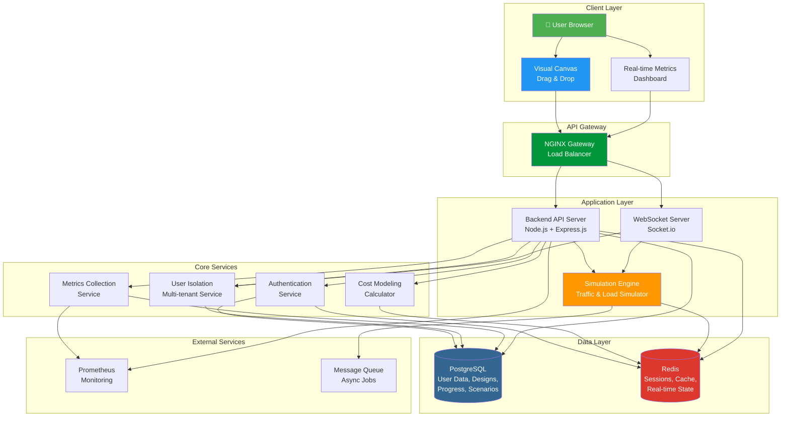

# System Architecture - System Design Simulator Platform

## Key Components:

### **Frontend (Client Layer)**
- **Visual Canvas**: Drag-and-drop interface for building system architectures
- **Real-time Metrics Dashboard**: Live visualization of performance, latency, errors, costs

### **API Gateway**
- **NGINX**: Load balancing, SSL termination, request routing

### **Backend (Application Layer)**
- **API Server**: REST API for CRUD operations, scenario management
- **WebSocket Server**: Real-time bidirectional communication for live simulations
- **Simulation Engine**: Core logic that simulates traffic, calculates bottlenecks, models failures

### **Core Services**
- **Authentication**: User login, signup, JWT tokens
- **User Isolation**: Multi-tenant data isolation and resource management
- **Metrics Collection**: Captures and aggregates simulation metrics
- **Cost Calculator**: Real-time cost modeling based on component usage

### **Data Layer**
- **PostgreSQL**: Persists user data, saved designs, learning progress, scenarios
- **Redis**: Caches session data, simulation state, frequently accessed data

### **Supporting Infrastructure**
- **Prometheus**: Monitors system health, performance metrics
- **Message Queue**: Handles async jobs (report generation, background processing)

## Data Flow:

1. **User Designs System** → Canvas → API → PostgreSQL
2. **User Runs Simulation** → WebSocket → Simulation Engine → Redis (state) → WebSocket → Metrics Dashboard
3. **Real-time Updates** → WebSocket pushes metrics, bottlenecks, failures to frontend
4. **Cost Calculation** → Triggered on component changes → Cost Calculator → Redis cache
5. **Monitoring** → All services send metrics → Prometheus
