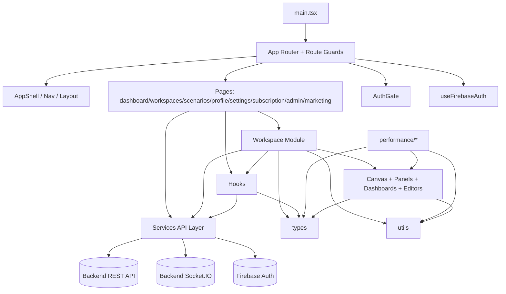
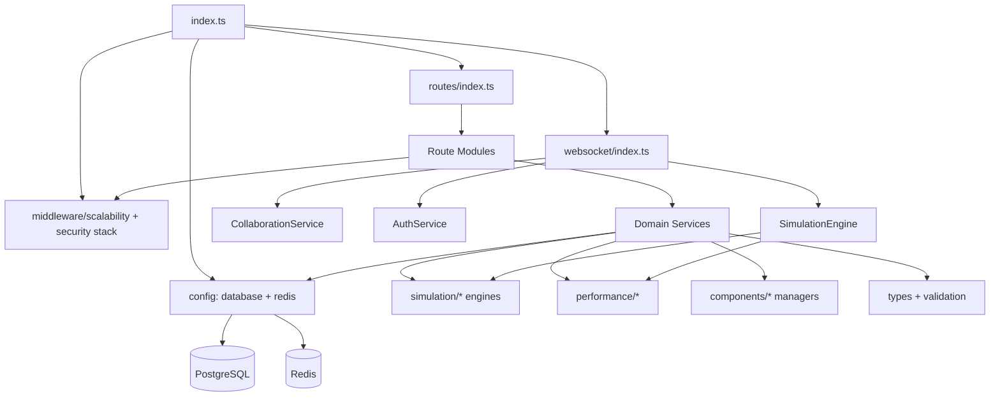

# Module Dependency Graph (Frontend + Backend)

## Scope
This graph is module-level (not file-level) and reflects the current import/runtime structure in `apps/frontend/src` and `apps/backend/src`.

## Frontend Module Graph

## Frontend Module Responsibilities + Dependencies
- `App Router + Guards`: route composition, auth/public route guard logic.
  - Depends on: `hooks/useFirebaseAuth`, `components/AuthGate`, `pages/*`, `components/AppShell`.
- `Pages`: route screens and page-level orchestration.
  - Depends on: `services/*`, `hooks/*`, route navigation.
- `Workspace Module`: main product surface (canvas, simulation controls, dashboards, scenario loading, autosave).
  - Depends on: `components/*`, `hooks/useWebSocket`, `hooks/useCollaboration`, `services/workspaceApi|scenarioApi`, `types`, `utils`.
- `Hooks`: reusable stateful integrations (`useWebSocket`, `useCollaboration`, auth/admin hooks).
  - Depends on: `services/*`, `types`.
- `Services`: IO boundary for REST/WebSocket/Firebase.
  - Depends on: backend APIs, Socket.IO client, Firebase client.
- `Types/Utils`: shared primitives and helpers.
  - No business-layer dependencies.

---

## Backend Module Graph

## Backend Module Responsibilities + Dependencies
- `index.ts` (composition root): boot sequence, middleware wiring, route mounting, websocket setup.
  - Depends on: `config/*`, `routes/*`, `websocket/*`.
- `routes/*`: HTTP contracts and request validation.
  - Depends on: `services/*`, `middleware/*`, `types/validation`.
- `middleware/*`: auth, subscription, audit, metrics, scalability cross-cutting behavior.
  - Depends on: `services/authService`, monitoring and scaling services.
- `services/*`: business/domain logic layer.
  - Depends on: `config/database|redis`, `simulation/*`, `components/*`, `types`.
- `websocket/*`: realtime protocol handlers, room membership, simulation control broadcast.
  - Depends on: `SimulationEngine`, `AuthService`, `CollaborationService`.
- `simulation/*`: discrete event core, scheduling, failure/load/metrics engines.
  - Depends on: `types`, performance support modules.
- `components/*` (backend): capacity/scaling/consistency domain managers.
  - Depends on: `types`.

---

## Route-Module to Service Dependency Map
- `routes/workspaces` -> `WorkspaceService`, `SharingService`, `VersionHistoryService`.
- `routes/simulation` -> `simulationService`, `simulationWorkloadRoutes`.
- `routes/scenarios` -> `scenarioService`.
- `routes/progress` -> `progressService`, `scenarioService`, `guidanceService`.
- `routes/subscription` -> `SubscriptionService`, `subscriptionMiddleware`.
- `routes/admin` -> `AdminService`, `adminAuth`.
- `websocket/index` -> `SimulationEngine`, `AuthService`, `CollaborationService`.

## Notable Structural Characteristics
- Frontend has one very large orchestration module: `components/Workspace.tsx`.
- Backend has two control planes for simulation (`REST /simulation/*` and Socket.IO `simulation:control`).
- Auth is hybrid: Firebase client auth in frontend; backend also has first-party JWT/session auth routes.
