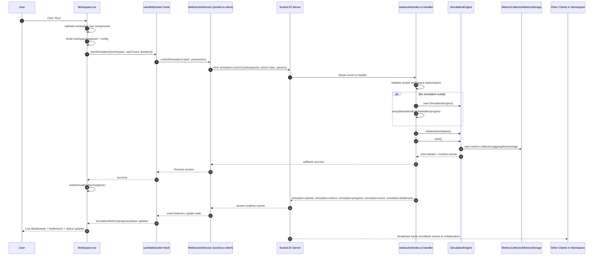
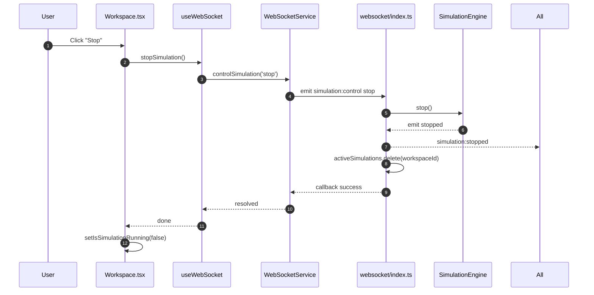

# Sequence Diagram: "Run Simulation" Path

## Primary Path Used by UI
Current workspace UI starts/stops simulation via Socket.IO (`wsStartSimulation`), not via `POST /api/v1/simulation/start`.

## Stop Path

## Data + Event Flow Notes
- Realtime state fan-out occurs through Socket.IO room `workspace-${workspaceId}`.
- Progress events are throttled server-side to ~1 update/sec (`event_processed` listener).
- Metrics events include both component-level and aggregated system-level payloads.
- Workspace join must happen before simulation control; client enforces this through `joinWorkspace` flow in `useWebSocket`.

## Failure Modes in Current Path
- If workspace has no components, UI blocks run and alerts user.
- If socket not connected or workspace not joined, client throws from `controlSimulation`.
- If server rejects action (`already running`, `not authorized`, invalid workspace), callback error propagates to UI alert.
